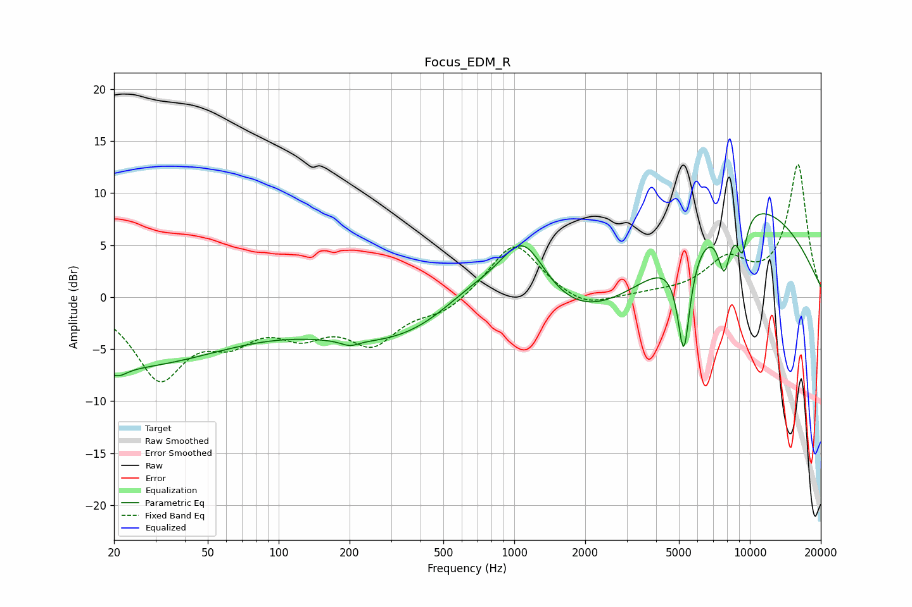

# Focus_EDM_R
See [usage instructions](https://github.com/jaakkopasanen/AutoEq#usage) for more options and info.

### Parametric EQs
Apply preamp of -8.1 dB when using parametric equalizer.

|   # | Type    |   Fc (Hz) |    Q |   Gain (dB) |
|-----|---------|-----------|------|-------------|
|   1 | Peaking |        21 | 0.29 |        -6.6 |
|   2 | Peaking |        21 | 3.67 |        -0.9 |
|   3 | Peaking |       200 | 3.89 |        -0.5 |
|   4 | Peaking |       662 | 0.74 |         5.3 |
|   5 | Peaking |       858 | 0.21 |        -7.6 |
|   6 | Peaking |      1092 | 1.26 |         8.2 |
|   7 | Peaking |      5242 | 5.14 |       -10   |
|   8 | Peaking |      7779 | 4.92 |        -4.8 |
|   9 | Peaking |      8878 | 0.33 |         9.8 |
|  10 | Peaking |      9285 | 5.77 |        -3.5 |

### Fixed Band EQs
When using fixed band (also called graphic) equalizer, apply preamp of **-12.8 dB** (if available) and set gains manually with these parameters.

|   # | Type    |   Fc (Hz) |    Q |   Gain (dB) |
|-----|---------|-----------|------|-------------|
|   1 | Peaking |        31 | 1.41 |        -7.4 |
|   2 | Peaking |        62 | 1.41 |        -3.1 |
|   3 | Peaking |       125 | 1.41 |        -2.8 |
|   4 | Peaking |       250 | 1.41 |        -4.1 |
|   5 | Peaking |       500 | 1.41 |        -1.4 |
|   6 | Peaking |      1000 | 1.41 |         5.4 |
|   7 | Peaking |      2000 | 1.41 |        -1.3 |
|   8 | Peaking |      4000 | 1.41 |         0.2 |
|   9 | Peaking |      8000 | 1.41 |         3.2 |
|  10 | Peaking |     16000 | 1.41 |        12.7 |

### Graphs

