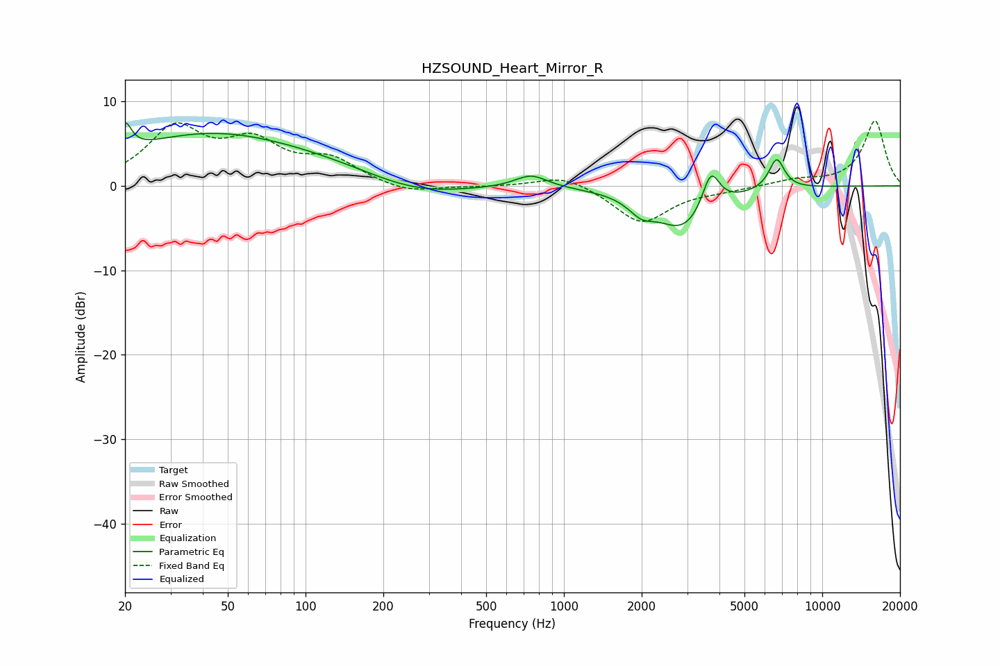

# HZSOUND_Heart_Mirror_R
See [usage instructions](https://github.com/jaakkopasanen/AutoEq#usage) for more options and info.

### Parametric EQs
Apply preamp of -7.6 dB when using parametric equalizer.

|   # | Type    |   Fc (Hz) |    Q |   Gain (dB) |
|-----|---------|-----------|------|-------------|
|   1 | Peaking |        20 | 5.8  |         3.2 |
|   2 | Peaking |        41 | 0.4  |         5.8 |
|   3 | Peaking |       123 | 0.51 |         1.3 |
|   4 | Peaking |       265 | 0.73 |        -1.7 |
|   5 | Peaking |       746 | 2.26 |         1.5 |
|   6 | Peaking |      1992 | 2.94 |        -1.7 |
|   7 | Peaking |      2918 | 1.28 |        -5.2 |
|   8 | Peaking |      3704 | 4.06 |         4.7 |
|   9 | Peaking |      6624 | 5.76 |        -0.4 |
|  10 | Peaking |      6658 | 4.65 |         4.1 |

### Fixed Band EQs
When using fixed band (also called graphic) equalizer, apply preamp of **-7.8 dB** (if available) and set gains manually with these parameters.

|   # | Type    |   Fc (Hz) |    Q |   Gain (dB) |
|-----|---------|-----------|------|-------------|
|   1 | Peaking |        31 | 1.41 |         6.5 |
|   2 | Peaking |        62 | 1.41 |         4.5 |
|   3 | Peaking |       125 | 1.41 |         2.8 |
|   4 | Peaking |       250 | 1.41 |        -1   |
|   5 | Peaking |       500 | 1.41 |        -0.1 |
|   6 | Peaking |      1000 | 1.41 |         1.4 |
|   7 | Peaking |      2000 | 1.41 |        -4.4 |
|   8 | Peaking |      4000 | 1.41 |        -0.4 |
|   9 | Peaking |      8000 | 1.41 |         0.7 |
|  10 | Peaking |     16000 | 1.41 |         7.7 |

### Graphs

