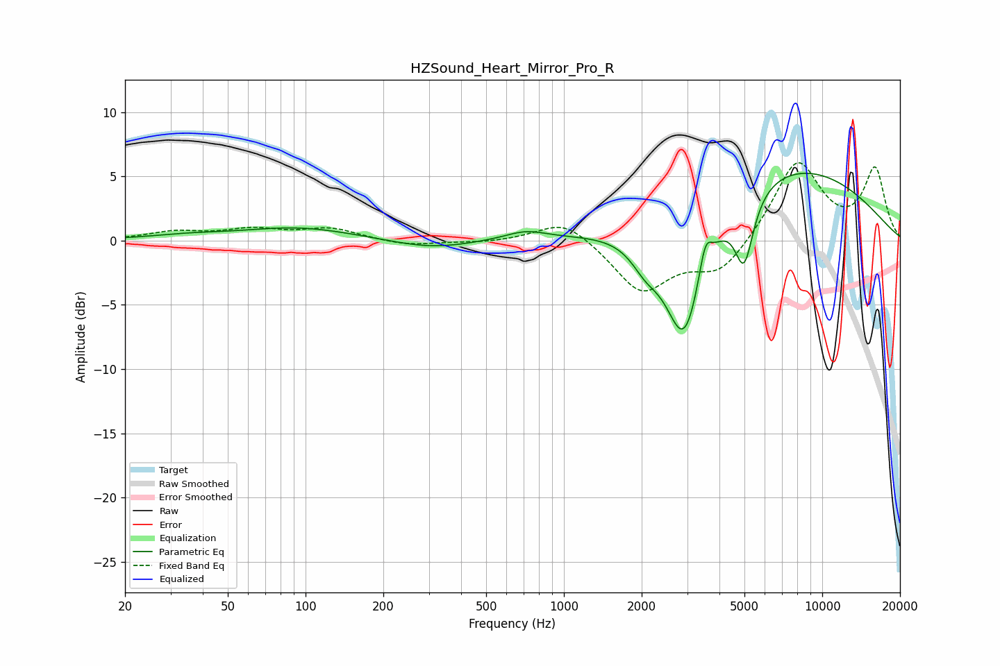

# HZSound_Heart_Mirror_Pro_R
See [usage instructions](https://github.com/jaakkopasanen/AutoEq#usage) for more options and info.

### Parametric EQs
Apply preamp of -5.3 dB when using parametric equalizer.

|   # | Type    |   Fc (Hz) |    Q |   Gain (dB) |
|-----|---------|-----------|------|-------------|
|   1 | Peaking |        35 | 0.95 |         0.3 |
|   2 | Peaking |        94 | 0.65 |         1   |
|   3 | Peaking |       306 | 0.91 |        -0.7 |
|   4 | Peaking |       712 | 1.73 |         0.7 |
|   5 | Peaking |      1969 | 1.75 |         0   |
|   6 | Peaking |      2071 | 2.54 |        -1.7 |
|   7 | Peaking |      2922 | 1.77 |       -10.4 |
|   8 | Peaking |      3526 | 5.8  |         2.6 |
|   9 | Peaking |      4984 | 3.82 |        -5.3 |
|  10 | Peaking |      6988 | 0.35 |         6.1 |

### Fixed Band EQs
When using fixed band (also called graphic) equalizer, apply preamp of **-6.2 dB** (if available) and set gains manually with these parameters.

|   # | Type    |   Fc (Hz) |    Q |   Gain (dB) |
|-----|---------|-----------|------|-------------|
|   1 | Peaking |        31 | 1.41 |         0.6 |
|   2 | Peaking |        62 | 1.41 |         0.8 |
|   3 | Peaking |       125 | 1.41 |         0.9 |
|   4 | Peaking |       250 | 1.41 |        -0.4 |
|   5 | Peaking |       500 | 1.41 |        -0.2 |
|   6 | Peaking |      1000 | 1.41 |         1.8 |
|   7 | Peaking |      2000 | 1.41 |        -4   |
|   8 | Peaking |      4000 | 1.41 |        -2.5 |
|   9 | Peaking |      8000 | 1.41 |         6.2 |
|  10 | Peaking |     16000 | 1.41 |         5.5 |

### Graphs

