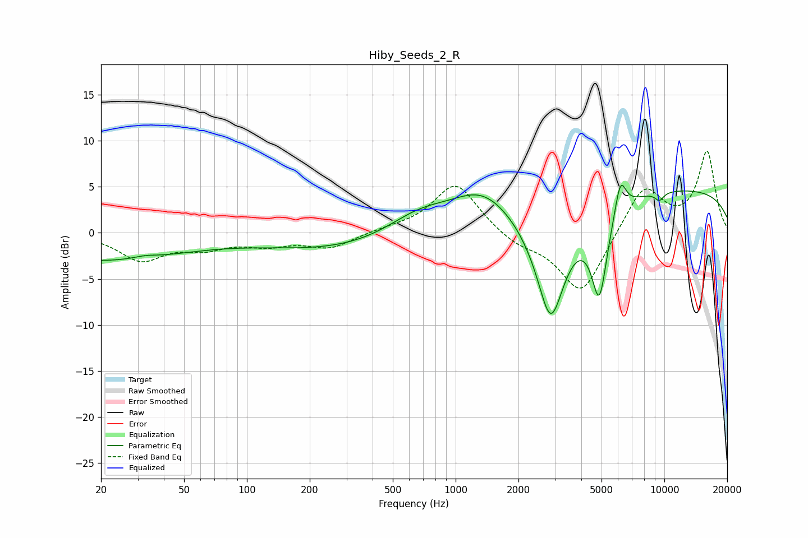

# Hiby_Seeds_2_R
See [usage instructions](https://github.com/jaakkopasanen/AutoEq#usage) for more options and info.

### Parametric EQs
Apply preamp of -5.3 dB when using parametric equalizer.

|   # | Type    |   Fc (Hz) |    Q |   Gain (dB) |
|-----|---------|-----------|------|-------------|
|   1 | Peaking |        20 | 0.36 |        -3   |
|   2 | Peaking |        32 | 2.49 |         0.3 |
|   3 | Peaking |       296 | 0.37 |        -1.9 |
|   4 | Peaking |       665 | 0.88 |         2.6 |
|   5 | Peaking |      1338 | 0.95 |         3.7 |
|   6 | Peaking |      2854 | 1.88 |       -12.5 |
|   7 | Peaking |      4882 | 3.58 |        -9.4 |
|   8 | Peaking |      6156 | 5.09 |         3.8 |
|   9 | Peaking |      9467 | 5.99 |        -0.9 |
|  10 | Peaking |     10000 | 0.18 |         4.8 |

### Fixed Band EQs
When using fixed band (also called graphic) equalizer, apply preamp of **-9.0 dB** (if available) and set gains manually with these parameters.

|   # | Type    |   Fc (Hz) |    Q |   Gain (dB) |
|-----|---------|-----------|------|-------------|
|   1 | Peaking |        31 | 1.41 |        -2.8 |
|   2 | Peaking |        62 | 1.41 |        -1.4 |
|   3 | Peaking |       125 | 1.41 |        -1.1 |
|   4 | Peaking |       250 | 1.41 |        -1.6 |
|   5 | Peaking |       500 | 1.41 |         0.3 |
|   6 | Peaking |      1000 | 1.41 |         5.5 |
|   7 | Peaking |      2000 | 1.41 |        -1.2 |
|   8 | Peaking |      4000 | 1.41 |        -6.8 |
|   9 | Peaking |      8000 | 1.41 |         5.2 |
|  10 | Peaking |     16000 | 1.41 |         8.7 |

### Graphs

