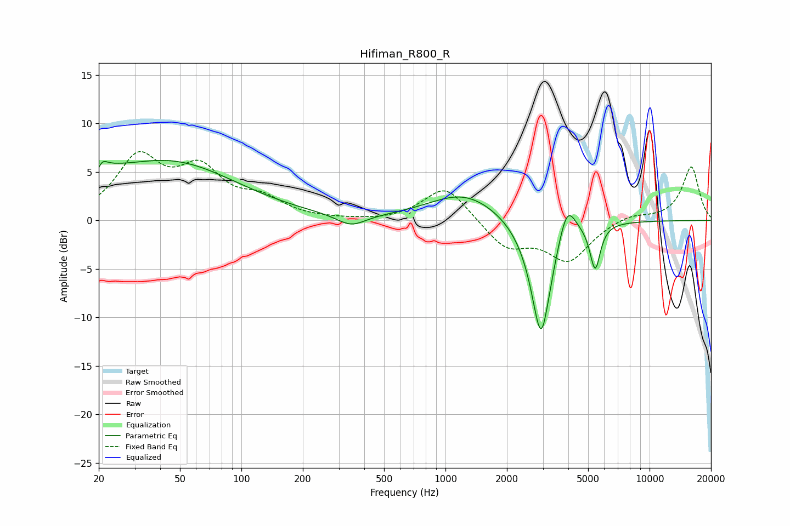

# Hifiman_R800_R
See [usage instructions](https://github.com/jaakkopasanen/AutoEq#usage) for more options and info.

### Parametric EQs
Apply preamp of -6.3 dB when using parametric equalizer.

|   # | Type    |   Fc (Hz) |    Q |   Gain (dB) |
|-----|---------|-----------|------|-------------|
|   1 | Peaking |        20 | 1.26 |         1.6 |
|   2 | Peaking |        20 | 5.98 |        -3.1 |
|   3 | Peaking |        20 | 5.78 |         3.3 |
|   4 | Peaking |        45 | 0.43 |         5.9 |
|   5 | Peaking |       345 | 1.97 |        -1.2 |
|   6 | Peaking |      1242 | 0.81 |         2.9 |
|   7 | Peaking |      2941 | 2.75 |       -12.7 |
|   8 | Peaking |      3938 | 3.38 |         3.8 |
|   9 | Peaking |      5315 | 4.83 |        -0.6 |
|  10 | Peaking |      5423 | 5.76 |        -4.1 |

### Fixed Band EQs
When using fixed band (also called graphic) equalizer, apply preamp of **-7.2 dB** (if available) and set gains manually with these parameters.

|   # | Type    |   Fc (Hz) |    Q |   Gain (dB) |
|-----|---------|-----------|------|-------------|
|   1 | Peaking |        31 | 1.41 |         6.1 |
|   2 | Peaking |        62 | 1.41 |         4.7 |
|   3 | Peaking |       125 | 1.41 |         1.9 |
|   4 | Peaking |       250 | 1.41 |         0   |
|   5 | Peaking |       500 | 1.41 |        -0.1 |
|   6 | Peaking |      1000 | 1.41 |         3.7 |
|   7 | Peaking |      2000 | 1.41 |        -2.8 |
|   8 | Peaking |      4000 | 1.41 |        -4   |
|   9 | Peaking |      8000 | 1.41 |         0.7 |
|  10 | Peaking |     16000 | 1.41 |         5.6 |

### Graphs

