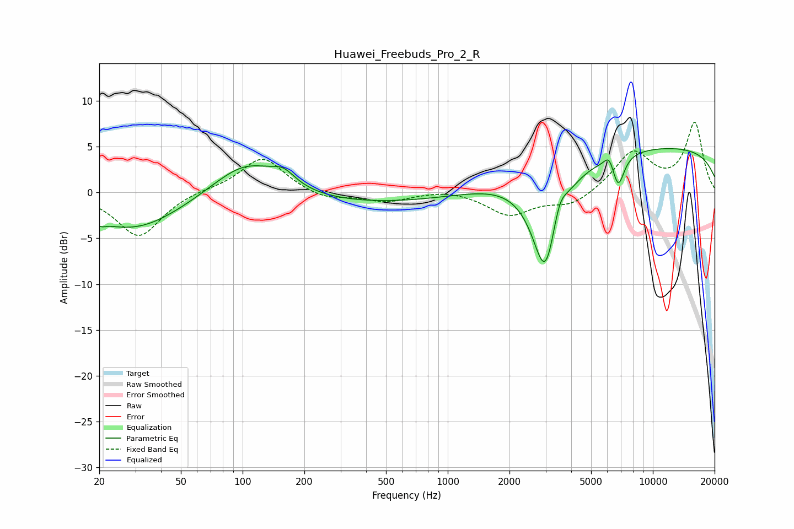

# Huawei_Freebuds_Pro_2_R
See [usage instructions](https://github.com/jaakkopasanen/AutoEq#usage) for more options and info.

### Parametric EQs
Apply preamp of -4.9 dB when using parametric equalizer.

|   # | Type    |   Fc (Hz) |    Q |   Gain (dB) |
|-----|---------|-----------|------|-------------|
|   1 | Peaking |        20 | 5.27 |        -0.5 |
|   2 | Peaking |        29 | 0.6  |        -4.1 |
|   3 | Peaking |       105 | 0.83 |         4.4 |
|   4 | Peaking |       158 | 2.51 |         1.3 |
|   5 | Peaking |       314 | 0.25 |        -1.4 |
|   6 | Peaking |      2994 | 2.1  |       -11.6 |
|   7 | Peaking |      3494 | 4.09 |         2.6 |
|   8 | Peaking |      6127 | 6    |         1.3 |
|   9 | Peaking |      6782 | 4.67 |        -3.4 |
|  10 | Peaking |     10000 | 0.18 |         5   |

### Fixed Band EQs
When using fixed band (also called graphic) equalizer, apply preamp of **-7.7 dB** (if available) and set gains manually with these parameters.

|   # | Type    |   Fc (Hz) |    Q |   Gain (dB) |
|-----|---------|-----------|------|-------------|
|   1 | Peaking |        31 | 1.41 |        -4.9 |
|   2 | Peaking |        62 | 1.41 |         0.3 |
|   3 | Peaking |       125 | 1.41 |         3.9 |
|   4 | Peaking |       250 | 1.41 |        -0.9 |
|   5 | Peaking |       500 | 1.41 |        -1   |
|   6 | Peaking |      1000 | 1.41 |         0.4 |
|   7 | Peaking |      2000 | 1.41 |        -2.4 |
|   8 | Peaking |      4000 | 1.41 |        -1.5 |
|   9 | Peaking |      8000 | 1.41 |         4.4 |
|  10 | Peaking |     16000 | 1.41 |         7.5 |

### Graphs

