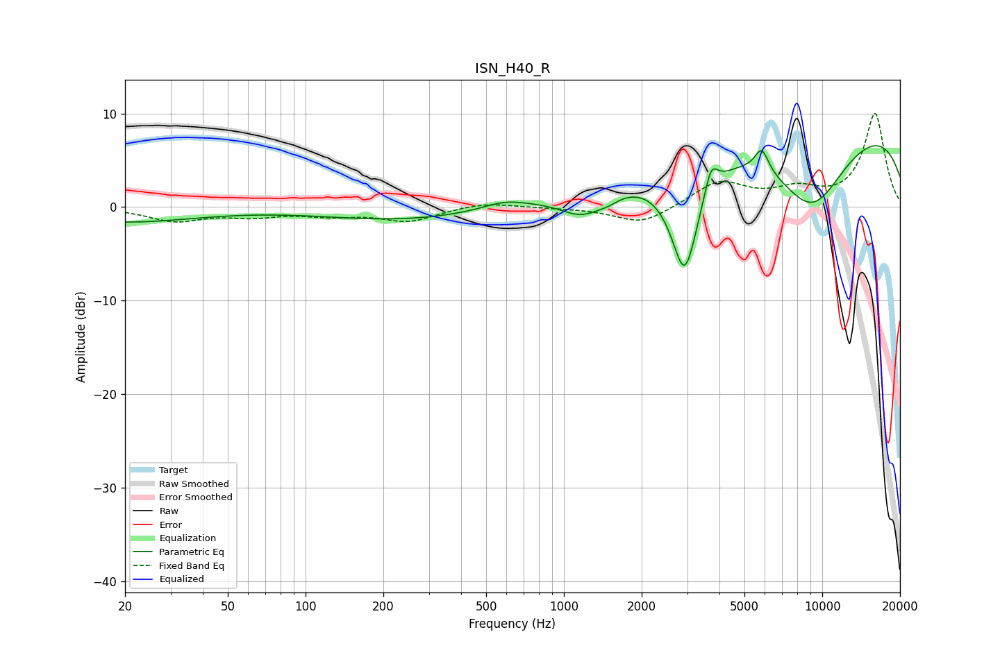

# ISN_H40_R
See [usage instructions](https://github.com/jaakkopasanen/AutoEq#usage) for more options and info.

### Parametric EQs
Apply preamp of -6.6 dB when using parametric equalizer.

|   # | Type    |   Fc (Hz) |    Q |   Gain (dB) |
|-----|---------|-----------|------|-------------|
|   1 | Peaking |        20 | 0.52 |        -1.6 |
|   2 | Peaking |       236 | 0.46 |        -1.3 |
|   3 | Peaking |       591 | 1.61 |         0.9 |
|   4 | Peaking |      1175 | 1.72 |        -2.3 |
|   5 | Peaking |      1479 | 3.09 |        -0.6 |
|   6 | Peaking |      2935 | 2.5  |       -11.8 |
|   7 | Peaking |      3712 | 5.63 |         2.9 |
|   8 | Peaking |      5833 | 5.22 |         2.5 |
|   9 | Peaking |      9097 | 0.84 |        -9.3 |
|  10 | Peaking |      9869 | 0.18 |        10   |

### Fixed Band EQs
When using fixed band (also called graphic) equalizer, apply preamp of **-10.1 dB** (if available) and set gains manually with these parameters.

|   # | Type    |   Fc (Hz) |    Q |   Gain (dB) |
|-----|---------|-----------|------|-------------|
|   1 | Peaking |        31 | 1.41 |        -1.4 |
|   2 | Peaking |        62 | 1.41 |        -0.8 |
|   3 | Peaking |       125 | 1.41 |        -0.7 |
|   4 | Peaking |       250 | 1.41 |        -1.4 |
|   5 | Peaking |       500 | 1.41 |         0.6 |
|   6 | Peaking |      1000 | 1.41 |        -0.1 |
|   7 | Peaking |      2000 | 1.41 |        -1.9 |
|   8 | Peaking |      4000 | 1.41 |         2.7 |
|   9 | Peaking |      8000 | 1.41 |         1.6 |
|  10 | Peaking |     16000 | 1.41 |        10   |

### Graphs

