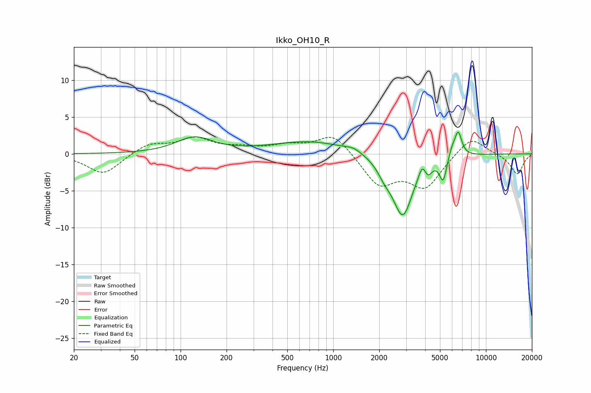

# Ikko_OH10_R
See [usage instructions](https://github.com/jaakkopasanen/AutoEq#usage) for more options and info.

### Parametric EQs
Apply preamp of -3.0 dB when using parametric equalizer.

|   # | Type    |   Fc (Hz) |    Q |   Gain (dB) |
|-----|---------|-----------|------|-------------|
|   1 | Peaking |       123 | 1.18 |         2.1 |
|   2 | Peaking |       709 | 0.55 |         1.7 |
|   3 | Peaking |      1356 | 2.84 |         0.5 |
|   4 | Peaking |      2172 | 3.02 |        -1.4 |
|   5 | Peaking |      2853 | 2.12 |        -8.3 |
|   6 | Peaking |      3823 | 6    |         1.6 |
|   7 | Peaking |      4186 | 6    |        -1.3 |
|   8 | Peaking |      5245 | 6    |        -3.2 |
|   9 | Peaking |      5983 | 5.99 |         1.1 |
|  10 | Peaking |      6580 | 5.84 |         3.3 |

### Fixed Band EQs
When using fixed band (also called graphic) equalizer, apply preamp of **-2.4 dB** (if available) and set gains manually with these parameters.

|   # | Type    |   Fc (Hz) |    Q |   Gain (dB) |
|-----|---------|-----------|------|-------------|
|   1 | Peaking |        31 | 1.41 |        -2.8 |
|   2 | Peaking |        62 | 1.41 |         1.4 |
|   3 | Peaking |       125 | 1.41 |         2   |
|   4 | Peaking |       250 | 1.41 |         0.6 |
|   5 | Peaking |       500 | 1.41 |         1   |
|   6 | Peaking |      1000 | 1.41 |         2.8 |
|   7 | Peaking |      2000 | 1.41 |        -4.1 |
|   8 | Peaking |      4000 | 1.41 |        -4.3 |
|   9 | Peaking |      8000 | 1.41 |         2.5 |
|  10 | Peaking |     16000 | 1.41 |        -2.8 |

### Graphs

