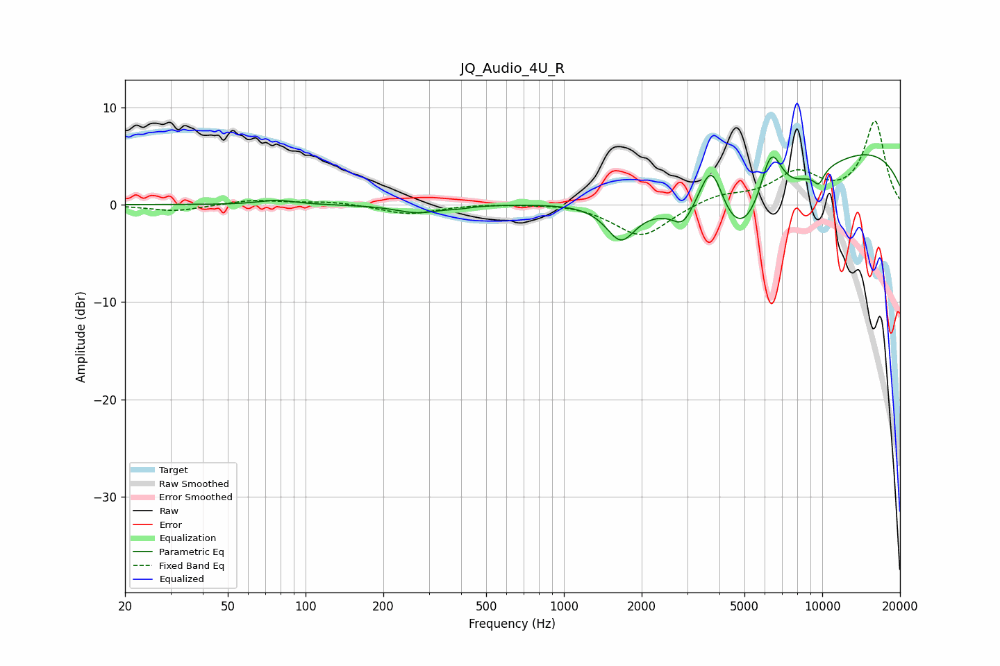

# JQ_Audio_4U_R
See [usage instructions](https://github.com/jaakkopasanen/AutoEq#usage) for more options and info.

### Parametric EQs
Apply preamp of -5.2 dB when using parametric equalizer.

|   # | Type    |   Fc (Hz) |    Q |   Gain (dB) |
|-----|---------|-----------|------|-------------|
|   1 | Peaking |        77 | 2.11 |         0.5 |
|   2 | Peaking |       271 | 1.69 |        -0.8 |
|   3 | Peaking |       391 | 3.37 |        -0.2 |
|   4 | Peaking |      1661 | 2.51 |        -3.7 |
|   5 | Peaking |      2884 | 3.85 |        -1.6 |
|   6 | Peaking |      3727 | 2.67 |         7.3 |
|   7 | Peaking |      4733 | 0.72 |       -11.2 |
|   8 | Peaking |      6325 | 2.92 |         6.6 |
|   9 | Peaking |      9605 | 0.2  |         6.8 |
|  10 | Peaking |      9694 | 6    |        -1.4 |

### Fixed Band EQs
When using fixed band (also called graphic) equalizer, apply preamp of **-8.7 dB** (if available) and set gains manually with these parameters.

|   # | Type    |   Fc (Hz) |    Q |   Gain (dB) |
|-----|---------|-----------|------|-------------|
|   1 | Peaking |        31 | 1.41 |        -0.7 |
|   2 | Peaking |        62 | 1.41 |         0.5 |
|   3 | Peaking |       125 | 1.41 |         0.3 |
|   4 | Peaking |       250 | 1.41 |        -1   |
|   5 | Peaking |       500 | 1.41 |         0.1 |
|   6 | Peaking |      1000 | 1.41 |         0.2 |
|   7 | Peaking |      2000 | 1.41 |        -3.4 |
|   8 | Peaking |      4000 | 1.41 |         1   |
|   9 | Peaking |      8000 | 1.41 |         3   |
|  10 | Peaking |     16000 | 1.41 |         8.5 |

### Graphs

