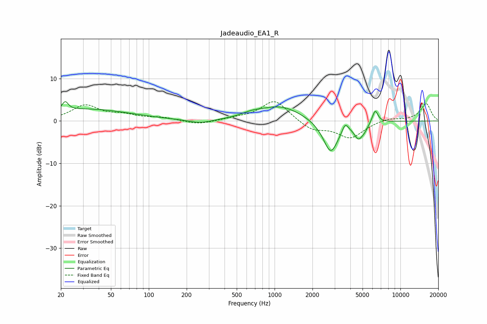

# Jadeaudio_EA1_R
See [usage instructions](https://github.com/jaakkopasanen/AutoEq#usage) for more options and info.

### Parametric EQs
Apply preamp of -4.7 dB when using parametric equalizer.

|   # | Type    |   Fc (Hz) |    Q |   Gain (dB) |
|-----|---------|-----------|------|-------------|
|   1 | Peaking |        22 | 5.97 |         2.1 |
|   2 | Peaking |        32 | 0.4  |         2.8 |
|   3 | Peaking |       257 | 1.56 |        -0.9 |
|   4 | Peaking |       655 | 1.73 |         0.8 |
|   5 | Peaking |      1113 | 0.83 |         3.5 |
|   6 | Peaking |      2792 | 2.31 |        -7.8 |
|   7 | Peaking |      3636 | 5.97 |         2.1 |
|   8 | Peaking |      4627 | 4.14 |        -3.2 |
|   9 | Peaking |      5165 | 4.58 |        -1.3 |
|  10 | Peaking |      6295 | 5.93 |         3.1 |

### Fixed Band EQs
When using fixed band (also called graphic) equalizer, apply preamp of **-4.6 dB** (if available) and set gains manually with these parameters.

|   # | Type    |   Fc (Hz) |    Q |   Gain (dB) |
|-----|---------|-----------|------|-------------|
|   1 | Peaking |        31 | 1.41 |         3.6 |
|   2 | Peaking |        62 | 1.41 |         1.2 |
|   3 | Peaking |       125 | 1.41 |         0.7 |
|   4 | Peaking |       250 | 1.41 |        -0.9 |
|   5 | Peaking |       500 | 1.41 |         0.5 |
|   6 | Peaking |      1000 | 1.41 |         5   |
|   7 | Peaking |      2000 | 1.41 |        -2.2 |
|   8 | Peaking |      4000 | 1.41 |        -3.9 |
|   9 | Peaking |      8000 | 1.41 |         0.7 |
|  10 | Peaking |     16000 | 1.41 |         4.1 |

### Graphs

