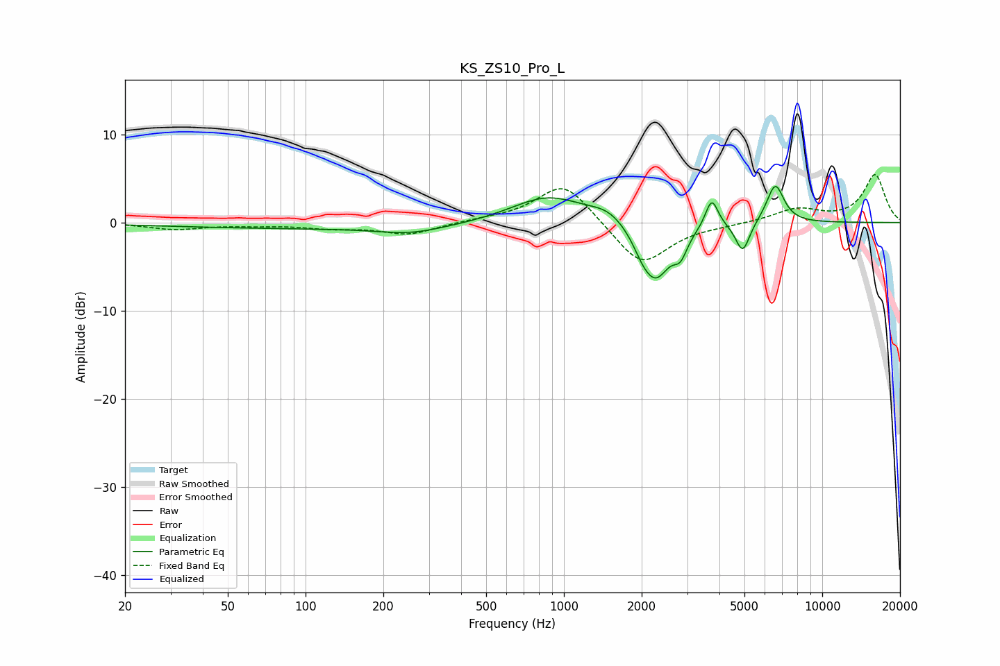

# KS_ZS10_Pro_L
See [usage instructions](https://github.com/jaakkopasanen/AutoEq#usage) for more options and info.

### Parametric EQs
Apply preamp of -4.2 dB when using parametric equalizer.

|   # | Type    |   Fc (Hz) |    Q |   Gain (dB) |
|-----|---------|-----------|------|-------------|
|   1 | Peaking |       132 | 0.18 |        -0.7 |
|   2 | Peaking |       255 | 1.15 |        -0.8 |
|   3 | Peaking |       864 | 0.97 |         3.2 |
|   4 | Peaking |      1495 | 1.98 |         1.3 |
|   5 | Peaking |      2001 | 4.34 |        -0.9 |
|   6 | Peaking |      2256 | 2.34 |        -6.5 |
|   7 | Peaking |      2826 | 5.43 |        -2.1 |
|   8 | Peaking |      3735 | 5.69 |         3.4 |
|   9 | Peaking |      4922 | 5.12 |        -3.5 |
|  10 | Peaking |      6581 | 4.04 |         4.4 |

### Fixed Band EQs
When using fixed band (also called graphic) equalizer, apply preamp of **-5.5 dB** (if available) and set gains manually with these parameters.

|   # | Type    |   Fc (Hz) |    Q |   Gain (dB) |
|-----|---------|-----------|------|-------------|
|   1 | Peaking |        31 | 1.41 |        -0.7 |
|   2 | Peaking |        62 | 1.41 |        -0.2 |
|   3 | Peaking |       125 | 1.41 |        -0.6 |
|   4 | Peaking |       250 | 1.41 |        -1.3 |
|   5 | Peaking |       500 | 1.41 |         0.2 |
|   6 | Peaking |      1000 | 1.41 |         4.7 |
|   7 | Peaking |      2000 | 1.41 |        -5.1 |
|   8 | Peaking |      4000 | 1.41 |        -0.2 |
|   9 | Peaking |      8000 | 1.41 |         1.5 |
|  10 | Peaking |     16000 | 1.41 |         5.4 |

### Graphs

