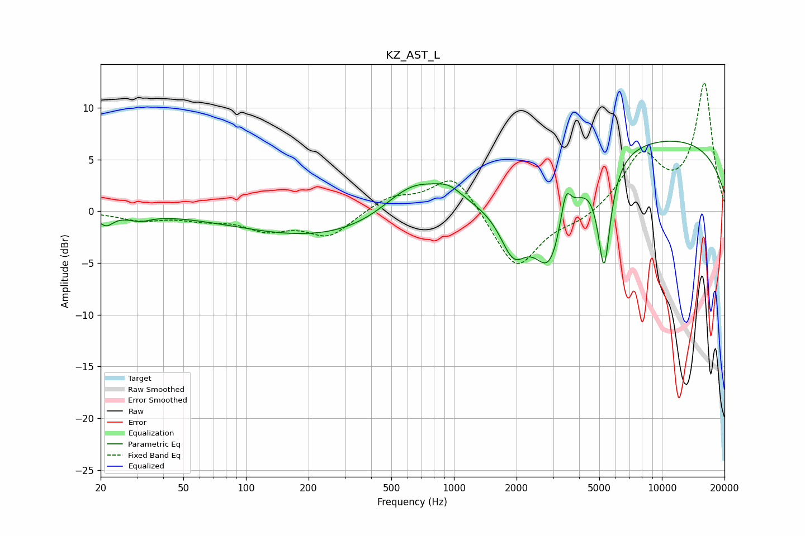

# KZ_AST_L
See [usage instructions](https://github.com/jaakkopasanen/AutoEq#usage) for more options and info.

### Parametric EQs
Apply preamp of -6.9 dB when using parametric equalizer.

|   # | Type    |   Fc (Hz) |    Q |   Gain (dB) |
|-----|---------|-----------|------|-------------|
|   1 | Peaking |        21 | 4.02 |        -1.1 |
|   2 | Peaking |        31 | 2.69 |        -0.6 |
|   3 | Peaking |       354 | 0.26 |        -3.1 |
|   4 | Peaking |       642 | 0.9  |         4.4 |
|   5 | Peaking |       950 | 2.08 |         1.2 |
|   6 | Peaking |      1934 | 2.09 |        -4.9 |
|   7 | Peaking |      2890 | 1.67 |        -8.7 |
|   8 | Peaking |      3446 | 5.7  |         3.4 |
|   9 | Peaking |      5276 | 4.61 |       -10.2 |
|  10 | Peaking |      8761 | 0.19 |         7.2 |

### Fixed Band EQs
When using fixed band (also called graphic) equalizer, apply preamp of **-12.5 dB** (if available) and set gains manually with these parameters.

|   # | Type    |   Fc (Hz) |    Q |   Gain (dB) |
|-----|---------|-----------|------|-------------|
|   1 | Peaking |        31 | 1.41 |        -0.8 |
|   2 | Peaking |        62 | 1.41 |        -0.6 |
|   3 | Peaking |       125 | 1.41 |        -1.6 |
|   4 | Peaking |       250 | 1.41 |        -2.4 |
|   5 | Peaking |       500 | 1.41 |         1.4 |
|   6 | Peaking |      1000 | 1.41 |         3.7 |
|   7 | Peaking |      2000 | 1.41 |        -5.8 |
|   8 | Peaking |      4000 | 1.41 |        -0.9 |
|   9 | Peaking |      8000 | 1.41 |         5.2 |
|  10 | Peaking |     16000 | 1.41 |        12.2 |

### Graphs

