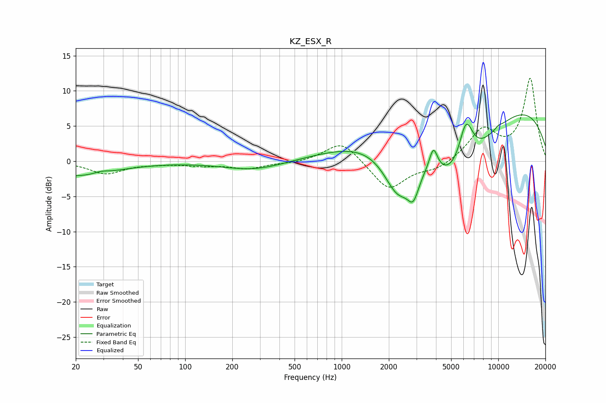

# KZ_ESX_R
See [usage instructions](https://github.com/jaakkopasanen/AutoEq#usage) for more options and info.

### Parametric EQs
Apply preamp of -6.7 dB when using parametric equalizer.

|   # | Type    |   Fc (Hz) |    Q |   Gain (dB) |
|-----|---------|-----------|------|-------------|
|   1 | Peaking |        20 | 0.58 |        -2.1 |
|   2 | Peaking |        29 | 3.24 |         0.3 |
|   3 | Peaking |       277 | 0.72 |        -1.3 |
|   4 | Peaking |      2284 | 1.47 |        -7   |
|   5 | Peaking |      2865 | 3.84 |        -3.6 |
|   6 | Peaking |      3851 | 5.35 |         3.3 |
|   7 | Peaking |      5475 | 0.6  |       -12.9 |
|   8 | Peaking |      6215 | 2.82 |         6.9 |
|   9 | Peaking |      7359 | 0.18 |        11.3 |
|  10 | Peaking |     10000 | 6    |         0.3 |

### Fixed Band EQs
When using fixed band (also called graphic) equalizer, apply preamp of **-11.9 dB** (if available) and set gains manually with these parameters.

|   # | Type    |   Fc (Hz) |    Q |   Gain (dB) |
|-----|---------|-----------|------|-------------|
|   1 | Peaking |        31 | 1.41 |        -1.7 |
|   2 | Peaking |        62 | 1.41 |        -0.2 |
|   3 | Peaking |       125 | 1.41 |        -0.5 |
|   4 | Peaking |       250 | 1.41 |        -1   |
|   5 | Peaking |       500 | 1.41 |        -0.3 |
|   6 | Peaking |      1000 | 1.41 |         3   |
|   7 | Peaking |      2000 | 1.41 |        -4.1 |
|   8 | Peaking |      4000 | 1.41 |        -1.1 |
|   9 | Peaking |      8000 | 1.41 |         4.4 |
|  10 | Peaking |     16000 | 1.41 |        11.7 |

### Graphs

