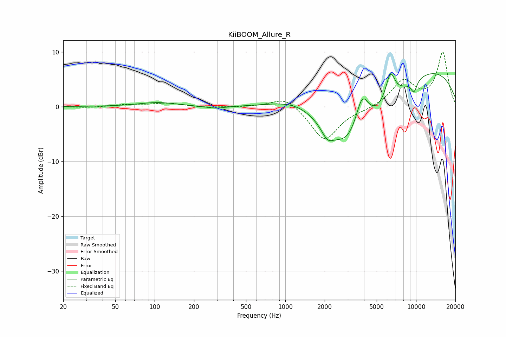

# KiiBOOM_Allure_R
See [usage instructions](https://github.com/jaakkopasanen/AutoEq#usage) for more options and info.

### Parametric EQs
Apply preamp of -6.1 dB when using parametric equalizer.

|   # | Type    |   Fc (Hz) |    Q |   Gain (dB) |
|-----|---------|-----------|------|-------------|
|   1 | Peaking |       105 | 0.99 |         0.7 |
|   2 | Peaking |       292 | 1.83 |        -0.4 |
|   3 | Peaking |      1324 | 0.65 |         4.2 |
|   4 | Peaking |      2096 | 3.29 |        -2   |
|   5 | Peaking |      3255 | 0.55 |       -13.8 |
|   6 | Peaking |      3866 | 2.47 |         7.8 |
|   7 | Peaking |      6364 | 3.74 |         5   |
|   8 | Peaking |      9641 | 5.18 |        -2.3 |
|   9 | Peaking |      9853 | 4.97 |         0.1 |
|  10 | Peaking |     10000 | 0.27 |         8.1 |

### Fixed Band EQs
When using fixed band (also called graphic) equalizer, apply preamp of **-10.0 dB** (if available) and set gains manually with these parameters.

|   # | Type    |   Fc (Hz) |    Q |   Gain (dB) |
|-----|---------|-----------|------|-------------|
|   1 | Peaking |        31 | 1.41 |        -0.2 |
|   2 | Peaking |        62 | 1.41 |         0.4 |
|   3 | Peaking |       125 | 1.41 |         0.6 |
|   4 | Peaking |       250 | 1.41 |        -0.2 |
|   5 | Peaking |       500 | 1.41 |        -0   |
|   6 | Peaking |      1000 | 1.41 |         2   |
|   7 | Peaking |      2000 | 1.41 |        -6.3 |
|   8 | Peaking |      4000 | 1.41 |        -0.4 |
|   9 | Peaking |      8000 | 1.41 |         4.6 |
|  10 | Peaking |     16000 | 1.41 |         9.8 |

### Graphs

