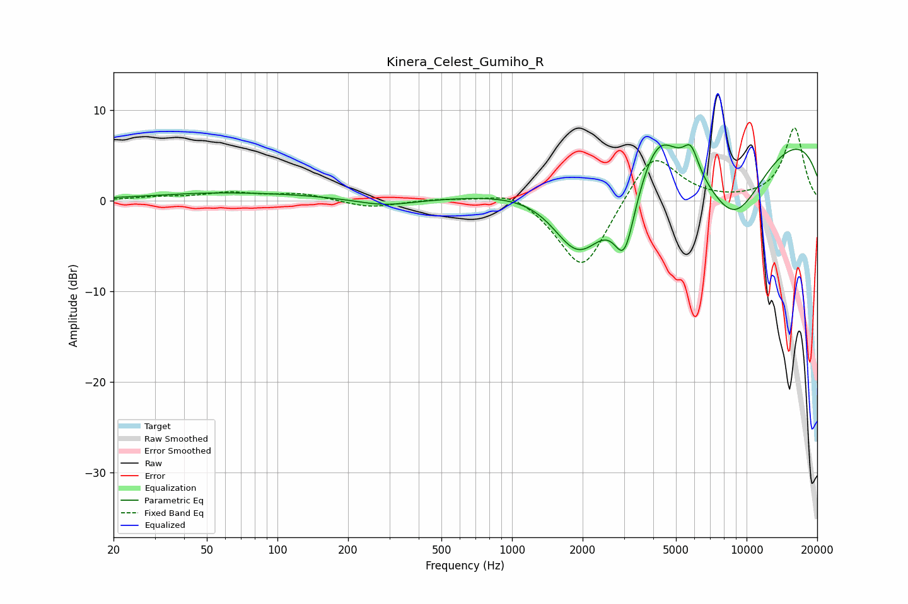

# Kinera_Celest_Gumiho_R
See [usage instructions](https://github.com/jaakkopasanen/AutoEq#usage) for more options and info.

### Parametric EQs
Apply preamp of -6.3 dB when using parametric equalizer.

|   # | Type    |   Fc (Hz) |    Q |   Gain (dB) |
|-----|---------|-----------|------|-------------|
|   1 | Peaking |        47 | 0.61 |         0.2 |
|   2 | Peaking |        78 | 0.36 |         0.7 |
|   3 | Peaking |       284 | 1.11 |        -0.8 |
|   4 | Peaking |      1868 | 1.4  |        -3.9 |
|   5 | Peaking |      2049 | 1.07 |        -5.5 |
|   6 | Peaking |      3020 | 2.87 |        -7.9 |
|   7 | Peaking |      4215 | 1.83 |         4   |
|   8 | Peaking |      5791 | 4.36 |         2.8 |
|   9 | Peaking |      8791 | 0.76 |       -11.3 |
|  10 | Peaking |      8881 | 0.18 |        10.3 |

### Fixed Band EQs
When using fixed band (also called graphic) equalizer, apply preamp of **-8.1 dB** (if available) and set gains manually with these parameters.

|   # | Type    |   Fc (Hz) |    Q |   Gain (dB) |
|-----|---------|-----------|------|-------------|
|   1 | Peaking |        31 | 1.41 |         0.3 |
|   2 | Peaking |        62 | 1.41 |         0.8 |
|   3 | Peaking |       125 | 1.41 |         0.7 |
|   4 | Peaking |       250 | 1.41 |        -0.8 |
|   5 | Peaking |       500 | 1.41 |         0.2 |
|   6 | Peaking |      1000 | 1.41 |         1.4 |
|   7 | Peaking |      2000 | 1.41 |        -8.1 |
|   8 | Peaking |      4000 | 1.41 |         5.7 |
|   9 | Peaking |      8000 | 1.41 |        -0.1 |
|  10 | Peaking |     16000 | 1.41 |         8   |

### Graphs

