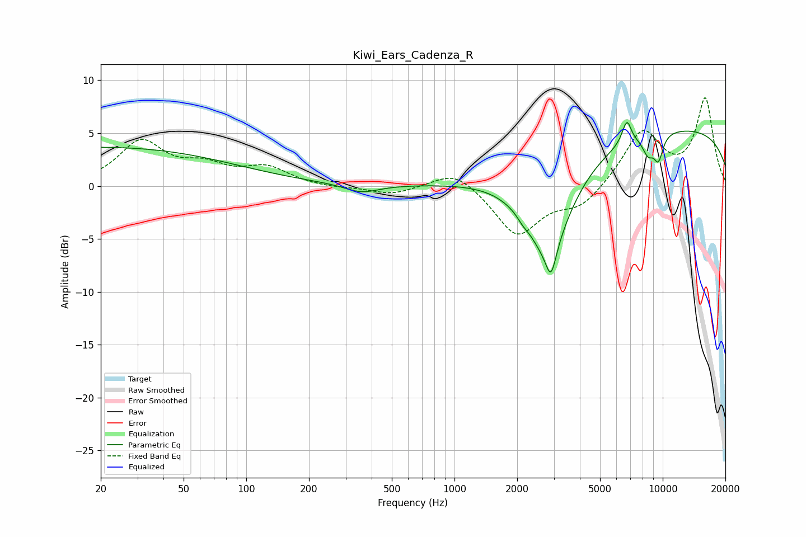

# Kiwi_Ears_Cadenza_R
See [usage instructions](https://github.com/jaakkopasanen/AutoEq#usage) for more options and info.

### Parametric EQs
Apply preamp of -6.1 dB when using parametric equalizer.

|   # | Type    |   Fc (Hz) |    Q |   Gain (dB) |
|-----|---------|-----------|------|-------------|
|   1 | Peaking |        20 | 0.21 |         3.7 |
|   2 | Peaking |       358 | 1.74 |        -0.8 |
|   3 | Peaking |      2126 | 5.87 |        -0.3 |
|   4 | Peaking |      2818 | 1.2  |        -9.2 |
|   5 | Peaking |      2908 | 6    |        -2.7 |
|   6 | Peaking |      6773 | 5.67 |         3.4 |
|   7 | Peaking |      6880 | 5.59 |        -1.2 |
|   8 | Peaking |      8516 | 4.59 |        -1.7 |
|   9 | Peaking |      9538 | 5.6  |        -2.3 |
|  10 | Peaking |     10000 | 0.18 |         5.6 |

### Fixed Band EQs
When using fixed band (also called graphic) equalizer, apply preamp of **-8.4 dB** (if available) and set gains manually with these parameters.

|   # | Type    |   Fc (Hz) |    Q |   Gain (dB) |
|-----|---------|-----------|------|-------------|
|   1 | Peaking |        31 | 1.41 |         4.1 |
|   2 | Peaking |        62 | 1.41 |         1.6 |
|   3 | Peaking |       125 | 1.41 |         1.6 |
|   4 | Peaking |       250 | 1.41 |        -0.2 |
|   5 | Peaking |       500 | 1.41 |        -0.8 |
|   6 | Peaking |      1000 | 1.41 |         1.7 |
|   7 | Peaking |      2000 | 1.41 |        -4.7 |
|   8 | Peaking |      4000 | 1.41 |        -1.9 |
|   9 | Peaking |      8000 | 1.41 |         5.2 |
|  10 | Peaking |     16000 | 1.41 |         8.1 |

### Graphs

