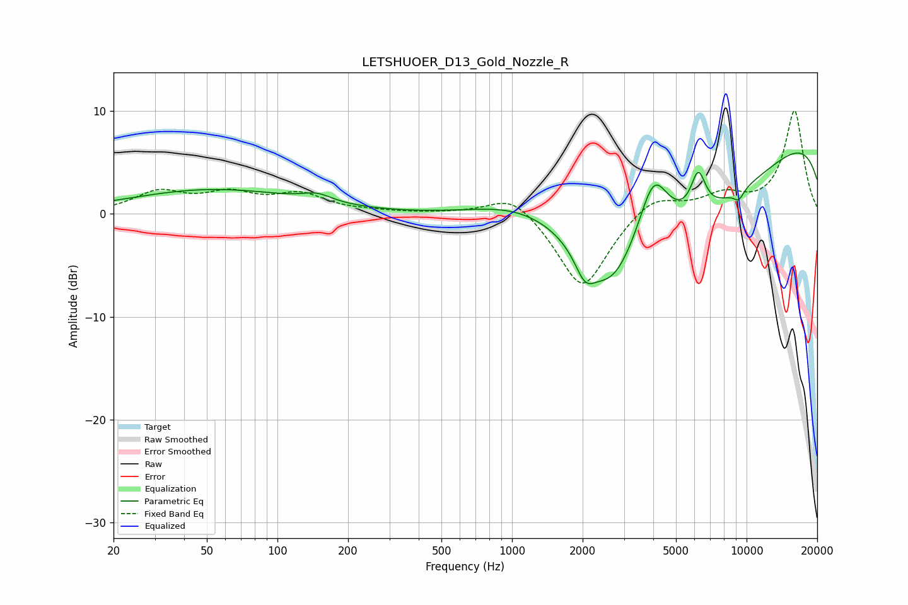

# LETSHUOER_D13_Gold_Nozzle_R
See [usage instructions](https://github.com/jaakkopasanen/AutoEq#usage) for more options and info.

### Parametric EQs
Apply preamp of -6.0 dB when using parametric equalizer.

|   # | Type    |   Fc (Hz) |    Q |   Gain (dB) |
|-----|---------|-----------|------|-------------|
|   1 | Peaking |        53 | 0.39 |         2.3 |
|   2 | Peaking |       148 | 2.26 |         0.8 |
|   3 | Peaking |      1144 | 0.57 |         4.3 |
|   4 | Peaking |      2046 | 3.26 |        -2.6 |
|   5 | Peaking |      2649 | 1.39 |        -4.6 |
|   6 | Peaking |      4014 | 2.13 |         6.6 |
|   7 | Peaking |      4146 | 0.25 |       -11.5 |
|   8 | Peaking |      6223 | 4.39 |         3.9 |
|   9 | Peaking |      9264 | 5.63 |        -1   |
|  10 | Peaking |     10000 | 0.18 |        10.5 |

### Fixed Band EQs
When using fixed band (also called graphic) equalizer, apply preamp of **-10.1 dB** (if available) and set gains manually with these parameters.

|   # | Type    |   Fc (Hz) |    Q |   Gain (dB) |
|-----|---------|-----------|------|-------------|
|   1 | Peaking |        31 | 1.41 |         2   |
|   2 | Peaking |        62 | 1.41 |         1.7 |
|   3 | Peaking |       125 | 1.41 |         1.7 |
|   4 | Peaking |       250 | 1.41 |         0.2 |
|   5 | Peaking |       500 | 1.41 |         0.1 |
|   6 | Peaking |      1000 | 1.41 |         2.2 |
|   7 | Peaking |      2000 | 1.41 |        -7.5 |
|   8 | Peaking |      4000 | 1.41 |         2   |
|   9 | Peaking |      8000 | 1.41 |         1.7 |
|  10 | Peaking |     16000 | 1.41 |        10   |

### Graphs

