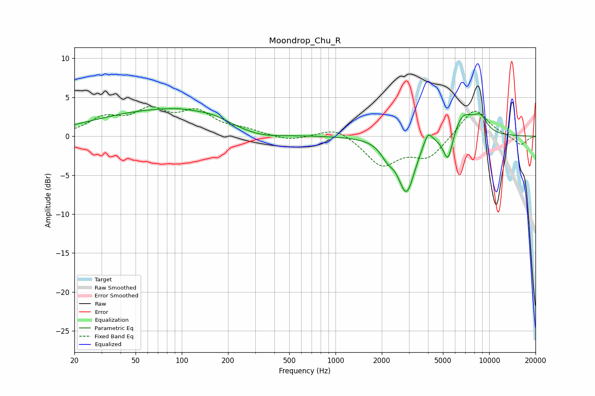

# Moondrop_Chu_R
See [usage instructions](https://github.com/jaakkopasanen/AutoEq#usage) for more options and info.

### Parametric EQs
Apply preamp of -3.6 dB when using parametric equalizer.

|   # | Type    |   Fc (Hz) |    Q |   Gain (dB) |
|-----|---------|-----------|------|-------------|
|   1 | Peaking |        78 | 0.31 |         3.4 |
|   2 | Peaking |        96 | 1.33 |         0.2 |
|   3 | Peaking |       157 | 1.56 |         0.4 |
|   4 | Peaking |       309 | 0.88 |        -1.1 |
|   5 | Peaking |      2175 | 3.28 |        -1.5 |
|   6 | Peaking |      2894 | 2.6  |        -7   |
|   7 | Peaking |      3995 | 4.88 |         1.9 |
|   8 | Peaking |      5390 | 4.51 |        -3.8 |
|   9 | Peaking |      6778 | 2.04 |         2.9 |
|  10 | Peaking |      8755 | 2.89 |         2   |

### Fixed Band EQs
When using fixed band (also called graphic) equalizer, apply preamp of **-3.9 dB** (if available) and set gains manually with these parameters.

|   # | Type    |   Fc (Hz) |    Q |   Gain (dB) |
|-----|---------|-----------|------|-------------|
|   1 | Peaking |        31 | 1.41 |         2.1 |
|   2 | Peaking |        62 | 1.41 |         2.9 |
|   3 | Peaking |       125 | 1.41 |         2.8 |
|   4 | Peaking |       250 | 1.41 |         0.7 |
|   5 | Peaking |       500 | 1.41 |        -0.6 |
|   6 | Peaking |      1000 | 1.41 |         1.3 |
|   7 | Peaking |      2000 | 1.41 |        -3.7 |
|   8 | Peaking |      4000 | 1.41 |        -2.7 |
|   9 | Peaking |      8000 | 1.41 |         3.7 |
|  10 | Peaking |     16000 | 1.41 |        -1.2 |

### Graphs

