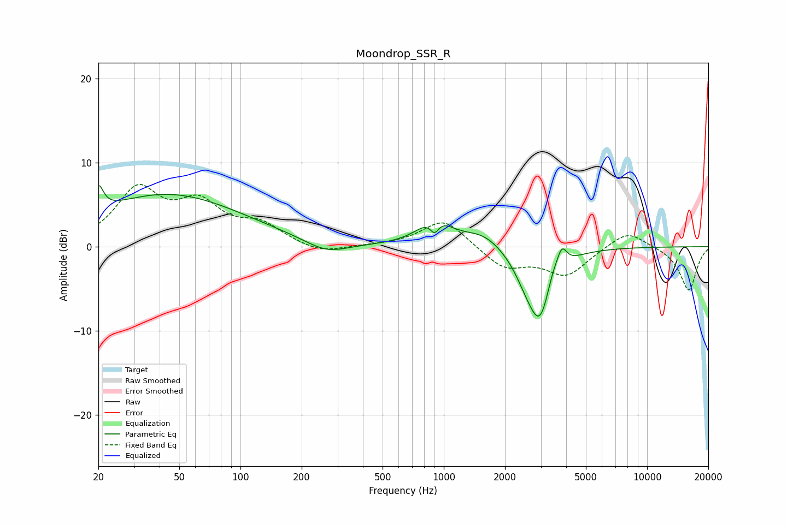

# Moondrop_SSR_R
See [usage instructions](https://github.com/jaakkopasanen/AutoEq#usage) for more options and info.

### Parametric EQs
Apply preamp of -7.4 dB when using parametric equalizer.

|   # | Type    |   Fc (Hz) |    Q |   Gain (dB) |
|-----|---------|-----------|------|-------------|
|   1 | Peaking |        20 | 5.92 |         3   |
|   2 | Peaking |        44 | 0.38 |         6.2 |
|   3 | Peaking |       265 | 1.34 |        -1.5 |
|   4 | Peaking |       900 | 5.98 |        -1.8 |
|   5 | Peaking |       903 | 1.85 |         3.3 |
|   6 | Peaking |      1563 | 1.45 |         1.7 |
|   7 | Peaking |      2543 | 2.3  |        -1.9 |
|   8 | Peaking |      2985 | 2.33 |        -8.3 |
|   9 | Peaking |      3415 | 4.13 |         1.9 |
|  10 | Peaking |      3811 | 5.95 |         2.4 |

### Fixed Band EQs
When using fixed band (also called graphic) equalizer, apply preamp of **-7.5 dB** (if available) and set gains manually with these parameters.

|   # | Type    |   Fc (Hz) |    Q |   Gain (dB) |
|-----|---------|-----------|------|-------------|
|   1 | Peaking |        31 | 1.41 |         6.5 |
|   2 | Peaking |        62 | 1.41 |         4.5 |
|   3 | Peaking |       125 | 1.41 |         2.3 |
|   4 | Peaking |       250 | 1.41 |        -1   |
|   5 | Peaking |       500 | 1.41 |         0.1 |
|   6 | Peaking |      1000 | 1.41 |         3.3 |
|   7 | Peaking |      2000 | 1.41 |        -2.5 |
|   8 | Peaking |      4000 | 1.41 |        -3.3 |
|   9 | Peaking |      8000 | 1.41 |         2.1 |
|  10 | Peaking |     16000 | 1.41 |        -5.2 |

### Graphs

