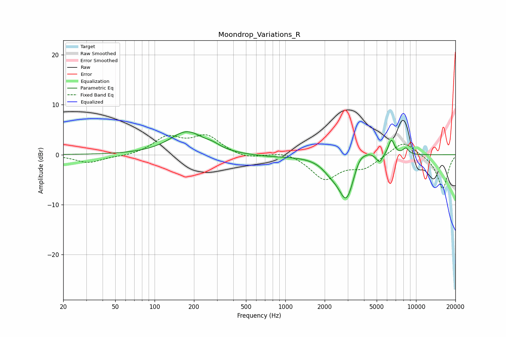

# Moondrop_Variations_R
See [usage instructions](https://github.com/jaakkopasanen/AutoEq#usage) for more options and info.

### Parametric EQs
Apply preamp of -4.7 dB when using parametric equalizer.

|   # | Type    |   Fc (Hz) |    Q |   Gain (dB) |
|-----|---------|-----------|------|-------------|
|   1 | Peaking |       177 | 1.08 |         4.6 |
|   2 | Peaking |       279 | 2.81 |         0.6 |
|   3 | Peaking |       707 | 0.74 |        -0.4 |
|   4 | Peaking |      2208 | 2.28 |        -1.4 |
|   5 | Peaking |      2936 | 2.16 |        -9.1 |
|   6 | Peaking |      3668 | 3.05 |         2.5 |
|   7 | Peaking |      4346 | 2.56 |         1.3 |
|   8 | Peaking |      5253 | 6    |        -1.6 |
|   9 | Peaking |      6476 | 5.67 |         3.2 |
|  10 | Peaking |      8353 | 5.63 |         1.3 |

### Fixed Band EQs
When using fixed band (also called graphic) equalizer, apply preamp of **-4.1 dB** (if available) and set gains manually with these parameters.

|   # | Type    |   Fc (Hz) |    Q |   Gain (dB) |
|-----|---------|-----------|------|-------------|
|   1 | Peaking |        31 | 1.41 |        -1.6 |
|   2 | Peaking |        62 | 1.41 |        -0.4 |
|   3 | Peaking |       125 | 1.41 |         3.3 |
|   4 | Peaking |       250 | 1.41 |         3.5 |
|   5 | Peaking |       500 | 1.41 |        -0.9 |
|   6 | Peaking |      1000 | 1.41 |         0.8 |
|   7 | Peaking |      2000 | 1.41 |        -4.8 |
|   8 | Peaking |      4000 | 1.41 |        -2.4 |
|   9 | Peaking |      8000 | 1.41 |         2.9 |
|  10 | Peaking |     16000 | 1.41 |        -6.9 |

### Graphs

