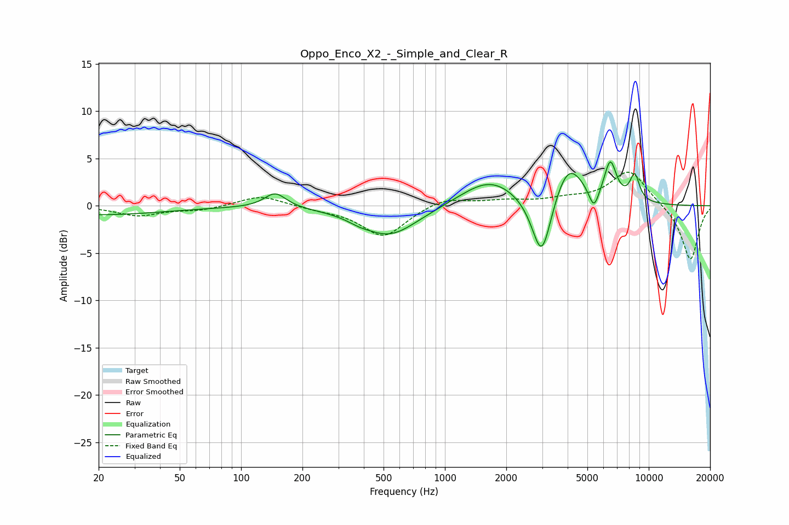

# Oppo_Enco_X2_-_Simple_and_Clear_R
See [usage instructions](https://github.com/jaakkopasanen/AutoEq#usage) for more options and info.

### Parametric EQs
Apply preamp of -4.7 dB when using parametric equalizer.

|   # | Type    |   Fc (Hz) |    Q |   Gain (dB) |
|-----|---------|-----------|------|-------------|
|   1 | Peaking |        20 | 0.43 |        -0.9 |
|   2 | Peaking |       147 | 2.67 |         1.6 |
|   3 | Peaking |       377 | 3.05 |        -0.3 |
|   4 | Peaking |       534 | 1    |        -3.2 |
|   5 | Peaking |      1660 | 1    |         2.9 |
|   6 | Peaking |      2985 | 2.9  |        -7.1 |
|   7 | Peaking |      4031 | 1.9  |         4.5 |
|   8 | Peaking |      5383 | 5.59 |        -2.3 |
|   9 | Peaking |      6479 | 4.57 |         4   |
|  10 | Peaking |      8530 | 5.52 |         2.8 |

### Fixed Band EQs
When using fixed band (also called graphic) equalizer, apply preamp of **-3.6 dB** (if available) and set gains manually with these parameters.

|   # | Type    |   Fc (Hz) |    Q |   Gain (dB) |
|-----|---------|-----------|------|-------------|
|   1 | Peaking |        31 | 1.41 |        -1   |
|   2 | Peaking |        62 | 1.41 |        -0.4 |
|   3 | Peaking |       125 | 1.41 |         1.1 |
|   4 | Peaking |       250 | 1.41 |        -0.3 |
|   5 | Peaking |       500 | 1.41 |        -3.3 |
|   6 | Peaking |      1000 | 1.41 |         0.9 |
|   7 | Peaking |      2000 | 1.41 |         0.5 |
|   8 | Peaking |      4000 | 1.41 |         0.6 |
|   9 | Peaking |      8000 | 1.41 |         3.8 |
|  10 | Peaking |     16000 | 1.41 |        -5.8 |

### Graphs

