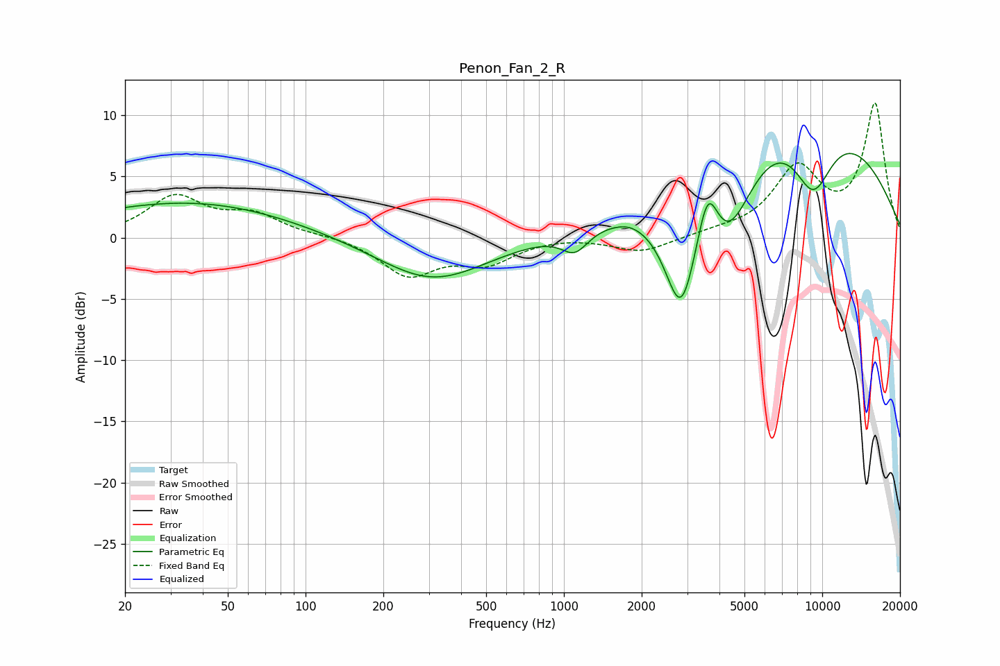

# Penon_Fan_2_R
See [usage instructions](https://github.com/jaakkopasanen/AutoEq#usage) for more options and info.

### Parametric EQs
Apply preamp of -7.0 dB when using parametric equalizer.

|   # | Type    |   Fc (Hz) |    Q |   Gain (dB) |
|-----|---------|-----------|------|-------------|
|   1 | Peaking |        27 | 0.25 |         1   |
|   2 | Peaking |        38 | 0.39 |         1.9 |
|   3 | Peaking |       310 | 0.67 |        -3.6 |
|   4 | Peaking |      1103 | 2.72 |        -1.8 |
|   5 | Peaking |      1799 | 3.17 |         0.1 |
|   6 | Peaking |      2844 | 2.05 |        -9.7 |
|   7 | Peaking |      3602 | 3.37 |         5.1 |
|   8 | Peaking |      4301 | 1.35 |        -6.7 |
|   9 | Peaking |      7816 | 0.31 |        11.4 |
|  10 | Peaking |      9220 | 1.54 |        -6.2 |

### Fixed Band EQs
When using fixed band (also called graphic) equalizer, apply preamp of **-11.1 dB** (if available) and set gains manually with these parameters.

|   # | Type    |   Fc (Hz) |    Q |   Gain (dB) |
|-----|---------|-----------|------|-------------|
|   1 | Peaking |        31 | 1.41 |         3.2 |
|   2 | Peaking |        62 | 1.41 |         1.7 |
|   3 | Peaking |       125 | 1.41 |         0.2 |
|   4 | Peaking |       250 | 1.41 |        -3   |
|   5 | Peaking |       500 | 1.41 |        -1.9 |
|   6 | Peaking |      1000 | 1.41 |         0.2 |
|   7 | Peaking |      2000 | 1.41 |        -1.2 |
|   8 | Peaking |      4000 | 1.41 |         0.3 |
|   9 | Peaking |      8000 | 1.41 |         5.4 |
|  10 | Peaking |     16000 | 1.41 |        10.8 |

### Graphs

