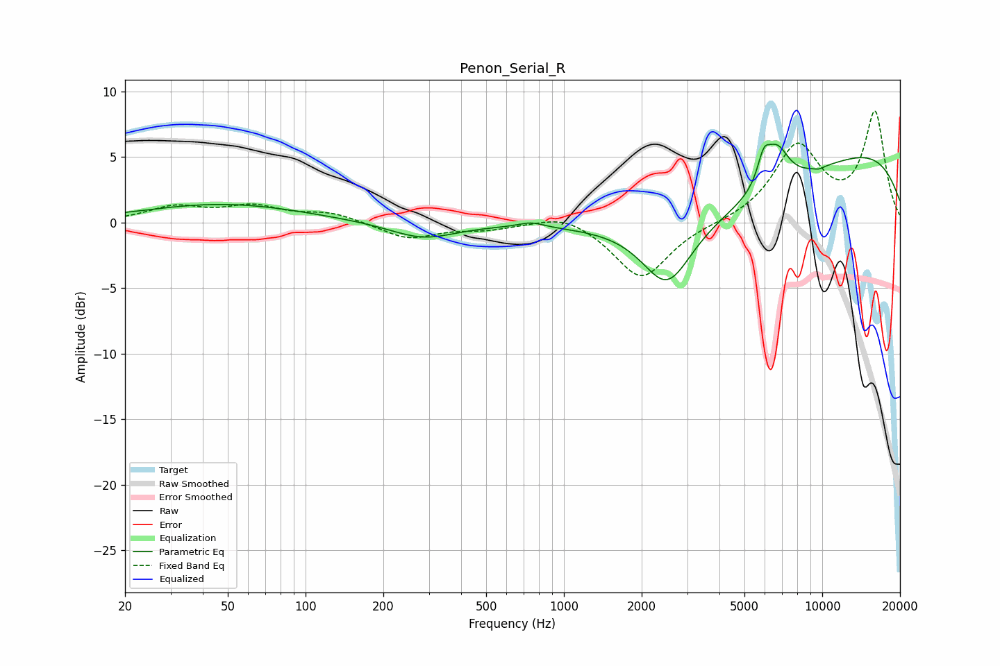

# Penon_Serial_R
See [usage instructions](https://github.com/jaakkopasanen/AutoEq#usage) for more options and info.

### Parametric EQs
Apply preamp of -6.1 dB when using parametric equalizer.

|   # | Type    |   Fc (Hz) |    Q |   Gain (dB) |
|-----|---------|-----------|------|-------------|
|   1 | Peaking |        49 | 0.45 |         1.4 |
|   2 | Peaking |        86 | 0.47 |        -0   |
|   3 | Peaking |       285 | 1.1  |        -1.2 |
|   4 | Peaking |       746 | 2.94 |         0.4 |
|   5 | Peaking |      2511 | 1.49 |        -4.8 |
|   6 | Peaking |      5803 | 0.32 |        -4.5 |
|   7 | Peaking |      5934 | 5.7  |         1.9 |
|   8 | Peaking |      6662 | 2.85 |         3   |
|   9 | Peaking |      9716 | 6    |        -0.2 |
|  10 | Peaking |     10000 | 0.24 |         7.8 |

### Fixed Band EQs
When using fixed band (also called graphic) equalizer, apply preamp of **-8.6 dB** (if available) and set gains manually with these parameters.

|   # | Type    |   Fc (Hz) |    Q |   Gain (dB) |
|-----|---------|-----------|------|-------------|
|   1 | Peaking |        31 | 1.41 |         1.1 |
|   2 | Peaking |        62 | 1.41 |         1.1 |
|   3 | Peaking |       125 | 1.41 |         0.7 |
|   4 | Peaking |       250 | 1.41 |        -1.2 |
|   5 | Peaking |       500 | 1.41 |        -0.4 |
|   6 | Peaking |      1000 | 1.41 |         0.8 |
|   7 | Peaking |      2000 | 1.41 |        -4.3 |
|   8 | Peaking |      4000 | 1.41 |        -0.1 |
|   9 | Peaking |      8000 | 1.41 |         5.7 |
|  10 | Peaking |     16000 | 1.41 |         8.3 |

### Graphs

