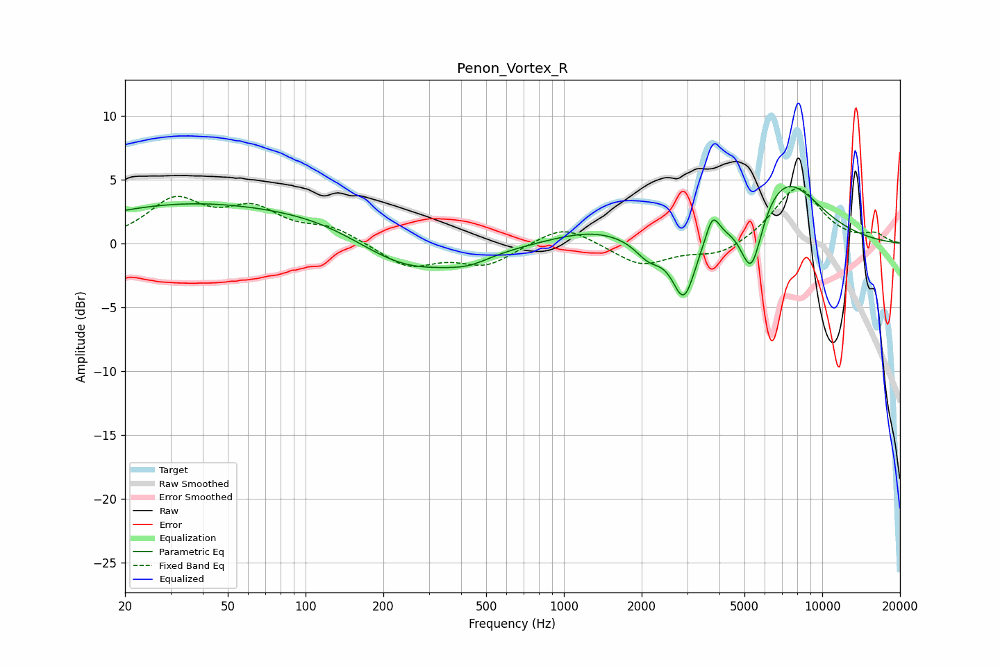

# Penon_Vortex_R
See [usage instructions](https://github.com/jaakkopasanen/AutoEq#usage) for more options and info.

### Parametric EQs
Apply preamp of -4.5 dB when using parametric equalizer.

|   # | Type    |   Fc (Hz) |    Q |   Gain (dB) |
|-----|---------|-----------|------|-------------|
|   1 | Peaking |        33 | 0.36 |         2.9 |
|   2 | Peaking |       128 | 0.56 |         1.6 |
|   3 | Peaking |       241 | 0.67 |        -2.9 |
|   4 | Peaking |       427 | 1.65 |        -0.7 |
|   5 | Peaking |      1293 | 0.88 |         1.1 |
|   6 | Peaking |      2134 | 2.65 |        -1.5 |
|   7 | Peaking |      2914 | 3.13 |        -4.9 |
|   8 | Peaking |      3761 | 5.39 |         2.1 |
|   9 | Peaking |      5317 | 3.3  |        -5.1 |
|  10 | Peaking |      7085 | 0.95 |         5.2 |

### Fixed Band EQs
When using fixed band (also called graphic) equalizer, apply preamp of **-4.4 dB** (if available) and set gains manually with these parameters.

|   # | Type    |   Fc (Hz) |    Q |   Gain (dB) |
|-----|---------|-----------|------|-------------|
|   1 | Peaking |        31 | 1.41 |         3.2 |
|   2 | Peaking |        62 | 1.41 |         2.4 |
|   3 | Peaking |       125 | 1.41 |         1.1 |
|   4 | Peaking |       250 | 1.41 |        -1.8 |
|   5 | Peaking |       500 | 1.41 |        -1.6 |
|   6 | Peaking |      1000 | 1.41 |         1.6 |
|   7 | Peaking |      2000 | 1.41 |        -1.7 |
|   8 | Peaking |      4000 | 1.41 |        -1   |
|   9 | Peaking |      8000 | 1.41 |         4.5 |
|  10 | Peaking |     16000 | 1.41 |         0.7 |

### Graphs

