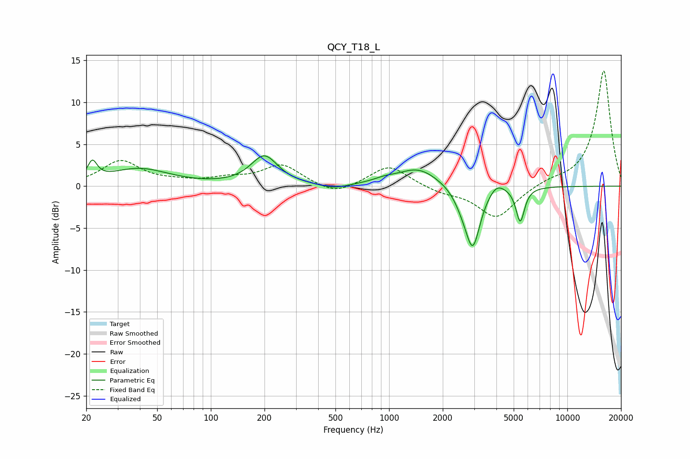

# QCY_T18_L
See [usage instructions](https://github.com/jaakkopasanen/AutoEq#usage) for more options and info.

### Parametric EQs
Apply preamp of -3.7 dB when using parametric equalizer.

|   # | Type    |   Fc (Hz) |    Q |   Gain (dB) |
|-----|---------|-----------|------|-------------|
|   1 | Peaking |        22 | 5.37 |         2.2 |
|   2 | Peaking |        40 | 0.84 |         2   |
|   3 | Peaking |       199 | 1.89 |         3.5 |
|   4 | Peaking |       488 | 1.92 |        -0.5 |
|   5 | Peaking |       943 | 2.13 |         0.4 |
|   6 | Peaking |      1459 | 1.25 |         2.1 |
|   7 | Peaking |      2560 | 3.18 |        -1.1 |
|   8 | Peaking |      2947 | 3.35 |        -7.1 |
|   9 | Peaking |      4009 | 3.16 |         1.1 |
|  10 | Peaking |      5442 | 5.86 |        -4.1 |

### Fixed Band EQs
When using fixed band (also called graphic) equalizer, apply preamp of **-13.8 dB** (if available) and set gains manually with these parameters.

|   # | Type    |   Fc (Hz) |    Q |   Gain (dB) |
|-----|---------|-----------|------|-------------|
|   1 | Peaking |        31 | 1.41 |         3   |
|   2 | Peaking |        62 | 1.41 |         0.4 |
|   3 | Peaking |       125 | 1.41 |         0.7 |
|   4 | Peaking |       250 | 1.41 |         2.5 |
|   5 | Peaking |       500 | 1.41 |        -1.2 |
|   6 | Peaking |      1000 | 1.41 |         2.5 |
|   7 | Peaking |      2000 | 1.41 |        -0.7 |
|   8 | Peaking |      4000 | 1.41 |        -3.8 |
|   9 | Peaking |      8000 | 1.41 |         0.5 |
|  10 | Peaking |     16000 | 1.41 |        13.9 |

### Graphs

