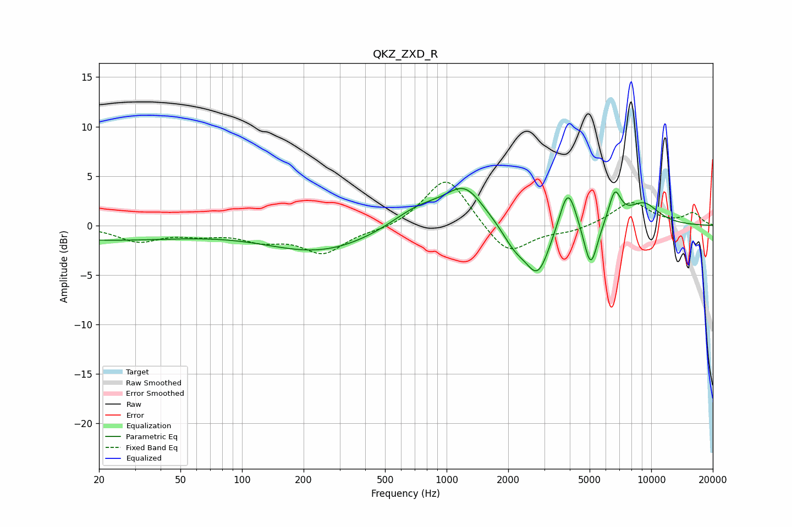

# QKZ_ZXD_R
See [usage instructions](https://github.com/jaakkopasanen/AutoEq#usage) for more options and info.

### Parametric EQs
Apply preamp of -3.8 dB when using parametric equalizer.

|   # | Type    |   Fc (Hz) |    Q |   Gain (dB) |
|-----|---------|-----------|------|-------------|
|   1 | Peaking |        20 | 0.31 |        -1.4 |
|   2 | Peaking |       242 | 0.53 |        -2.6 |
|   3 | Peaking |       735 | 1.03 |         2.1 |
|   4 | Peaking |      1229 | 1.51 |         3.5 |
|   5 | Peaking |      2153 | 2.28 |        -1.9 |
|   6 | Peaking |      2793 | 2.34 |        -4.9 |
|   7 | Peaking |      3915 | 3.35 |         4.6 |
|   8 | Peaking |      5060 | 4.08 |        -4.8 |
|   9 | Peaking |      6637 | 4.46 |         3.2 |
|  10 | Peaking |      9179 | 1.62 |         2.2 |

### Fixed Band EQs
When using fixed band (also called graphic) equalizer, apply preamp of **-4.5 dB** (if available) and set gains manually with these parameters.

|   # | Type    |   Fc (Hz) |    Q |   Gain (dB) |
|-----|---------|-----------|------|-------------|
|   1 | Peaking |        31 | 1.41 |        -1.5 |
|   2 | Peaking |        62 | 1.41 |        -0.7 |
|   3 | Peaking |       125 | 1.41 |        -1.3 |
|   4 | Peaking |       250 | 1.41 |        -2.7 |
|   5 | Peaking |       500 | 1.41 |        -0.5 |
|   6 | Peaking |      1000 | 1.41 |         5.1 |
|   7 | Peaking |      2000 | 1.41 |        -3.2 |
|   8 | Peaking |      4000 | 1.41 |        -0.6 |
|   9 | Peaking |      8000 | 1.41 |         2.4 |
|  10 | Peaking |     16000 | 1.41 |         1.2 |

### Graphs

