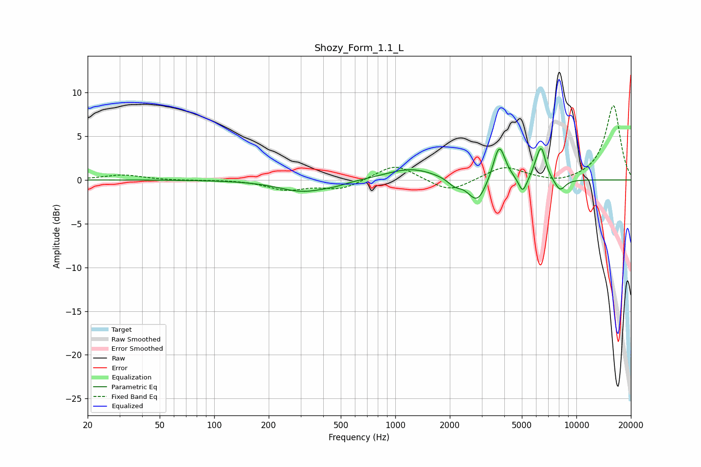

# Shozy_Form_1.1_L
See [usage instructions](https://github.com/jaakkopasanen/AutoEq#usage) for more options and info.

### Parametric EQs
Apply preamp of -3.7 dB when using parametric equalizer.

|   # | Type    |   Fc (Hz) |    Q |   Gain (dB) |
|-----|---------|-----------|------|-------------|
|   1 | Peaking |       310 | 1.05 |        -1.3 |
|   2 | Peaking |       465 | 2.19 |        -0.2 |
|   3 | Peaking |      1220 | 1.02 |         1.4 |
|   4 | Peaking |      2121 | 3.96 |        -0.7 |
|   5 | Peaking |      2835 | 2.77 |        -2.8 |
|   6 | Peaking |      3750 | 4.21 |         4.2 |
|   7 | Peaking |      5053 | 6    |        -1.8 |
|   8 | Peaking |      6026 | 5.99 |         0.9 |
|   9 | Peaking |      6421 | 5.83 |         3.3 |
|  10 | Peaking |      8126 | 4.31 |        -1.4 |

### Fixed Band EQs
When using fixed band (also called graphic) equalizer, apply preamp of **-8.6 dB** (if available) and set gains manually with these parameters.

|   # | Type    |   Fc (Hz) |    Q |   Gain (dB) |
|-----|---------|-----------|------|-------------|
|   1 | Peaking |        31 | 1.41 |         0.6 |
|   2 | Peaking |        62 | 1.41 |        -0.1 |
|   3 | Peaking |       125 | 1.41 |         0   |
|   4 | Peaking |       250 | 1.41 |        -1.1 |
|   5 | Peaking |       500 | 1.41 |        -1.1 |
|   6 | Peaking |      1000 | 1.41 |         1.9 |
|   7 | Peaking |      2000 | 1.41 |        -1.5 |
|   8 | Peaking |      4000 | 1.41 |         1.6 |
|   9 | Peaking |      8000 | 1.41 |        -0.5 |
|  10 | Peaking |     16000 | 1.41 |         8.5 |

### Graphs

