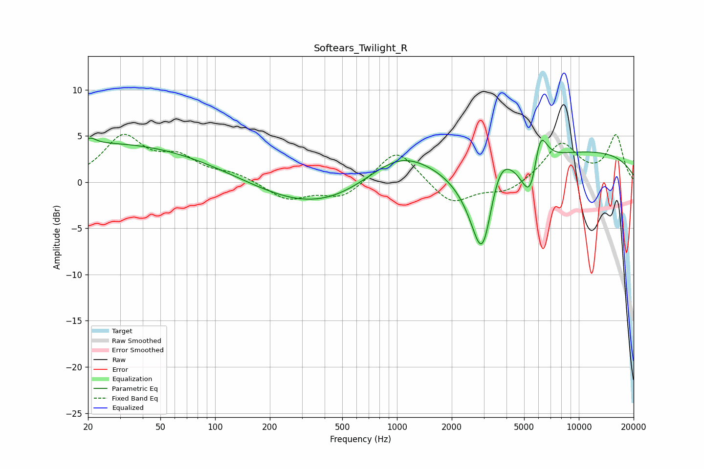

# Softears_Twilight_R
See [usage instructions](https://github.com/jaakkopasanen/AutoEq#usage) for more options and info.

### Parametric EQs
Apply preamp of -4.9 dB when using parametric equalizer.

|   # | Type    |   Fc (Hz) |    Q |   Gain (dB) |
|-----|---------|-----------|------|-------------|
|   1 | Peaking |        21 | 4.71 |         0.6 |
|   2 | Peaking |        21 | 0.21 |         3.8 |
|   3 | Peaking |        66 | 0.27 |         0.6 |
|   4 | Peaking |       365 | 0.44 |        -3.1 |
|   5 | Peaking |      1034 | 0.74 |         3.7 |
|   6 | Peaking |      2956 | 1.98 |       -11.9 |
|   7 | Peaking |      3602 | 1.86 |         5   |
|   8 | Peaking |      5482 | 2.68 |        -6   |
|   9 | Peaking |      6091 | 3.47 |         5.5 |
|  10 | Peaking |      9989 | 0.24 |         3.4 |

### Fixed Band EQs
When using fixed band (also called graphic) equalizer, apply preamp of **-5.3 dB** (if available) and set gains manually with these parameters.

|   # | Type    |   Fc (Hz) |    Q |   Gain (dB) |
|-----|---------|-----------|------|-------------|
|   1 | Peaking |        31 | 1.41 |         4.7 |
|   2 | Peaking |        62 | 1.41 |         2.3 |
|   3 | Peaking |       125 | 1.41 |         0.8 |
|   4 | Peaking |       250 | 1.41 |        -1.9 |
|   5 | Peaking |       500 | 1.41 |        -1.7 |
|   6 | Peaking |      1000 | 1.41 |         3.8 |
|   7 | Peaking |      2000 | 1.41 |        -2.5 |
|   8 | Peaking |      4000 | 1.41 |        -1.2 |
|   9 | Peaking |      8000 | 1.41 |         4.2 |
|  10 | Peaking |     16000 | 1.41 |         5   |

### Graphs

