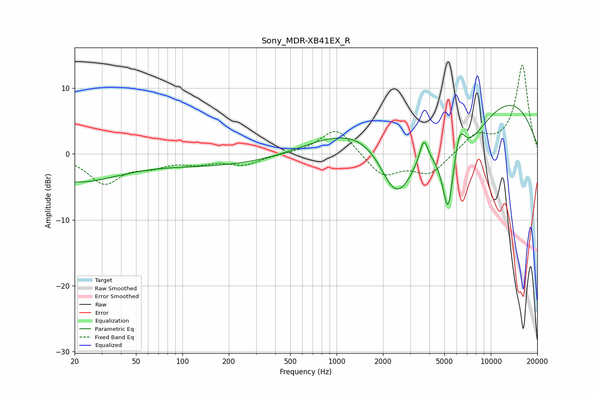

# Sony_MDR-XB41EX_R
See [usage instructions](https://github.com/jaakkopasanen/AutoEq#usage) for more options and info.

### Parametric EQs
Apply preamp of -7.5 dB when using parametric equalizer.

|   # | Type    |   Fc (Hz) |    Q |   Gain (dB) |
|-----|---------|-----------|------|-------------|
|   1 | Peaking |        20 | 0.48 |        -4.1 |
|   2 | Peaking |       201 | 0.31 |        -1.8 |
|   3 | Peaking |      2386 | 1.47 |        -5.2 |
|   4 | Peaking |      2630 | 0.94 |        -7.1 |
|   5 | Peaking |      3667 | 5.32 |         3.6 |
|   6 | Peaking |      5092 | 0.18 |        10   |
|   7 | Peaking |      5269 | 3.88 |        -9.8 |
|   8 | Peaking |      6272 | 3.82 |         5.1 |
|   9 | Peaking |      6444 | 0.65 |       -11.1 |
|  10 | Peaking |     10000 | 0.31 |         4.3 |

### Fixed Band EQs
When using fixed band (also called graphic) equalizer, apply preamp of **-13.6 dB** (if available) and set gains manually with these parameters.

|   # | Type    |   Fc (Hz) |    Q |   Gain (dB) |
|-----|---------|-----------|------|-------------|
|   1 | Peaking |        31 | 1.41 |        -4.3 |
|   2 | Peaking |        62 | 1.41 |        -1.4 |
|   3 | Peaking |       125 | 1.41 |        -1.1 |
|   4 | Peaking |       250 | 1.41 |        -1.5 |
|   5 | Peaking |       500 | 1.41 |         0   |
|   6 | Peaking |      1000 | 1.41 |         4.2 |
|   7 | Peaking |      2000 | 1.41 |        -3.4 |
|   8 | Peaking |      4000 | 1.41 |        -3   |
|   9 | Peaking |      8000 | 1.41 |         2.7 |
|  10 | Peaking |     16000 | 1.41 |        13.5 |

### Graphs

