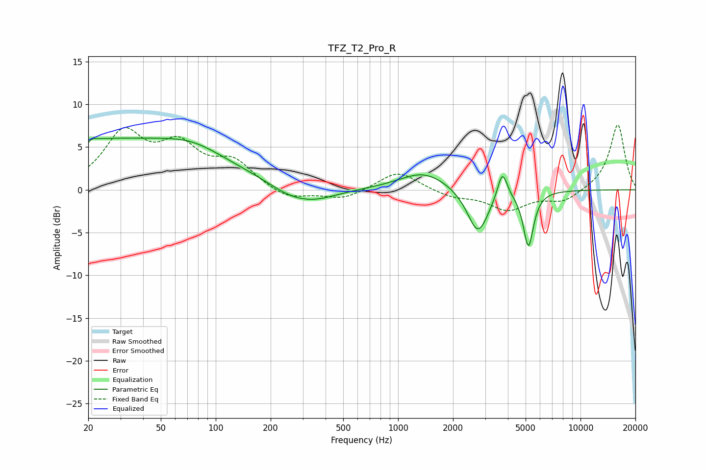

# TFZ_T2_Pro_R
See [usage instructions](https://github.com/jaakkopasanen/AutoEq#usage) for more options and info.

### Parametric EQs
Apply preamp of -6.1 dB when using parametric equalizer.

|   # | Type    |   Fc (Hz) |    Q |   Gain (dB) |
|-----|---------|-----------|------|-------------|
|   1 | Peaking |        20 | 5.97 |        -3.6 |
|   2 | Peaking |        20 | 6    |         3.2 |
|   3 | Peaking |        23 | 0.19 |         5.9 |
|   4 | Peaking |        74 | 0.92 |         1.2 |
|   5 | Peaking |       250 | 1.2  |        -1   |
|   6 | Peaking |       343 | 1.06 |        -1.4 |
|   7 | Peaking |      1387 | 1.05 |         2.2 |
|   8 | Peaking |      2741 | 2.43 |        -5.3 |
|   9 | Peaking |      3729 | 5.29 |         3.3 |
|  10 | Peaking |      5183 | 5.05 |        -6.5 |

### Fixed Band EQs
When using fixed band (also called graphic) equalizer, apply preamp of **-7.7 dB** (if available) and set gains manually with these parameters.

|   # | Type    |   Fc (Hz) |    Q |   Gain (dB) |
|-----|---------|-----------|------|-------------|
|   1 | Peaking |        31 | 1.41 |         6.3 |
|   2 | Peaking |        62 | 1.41 |         4.5 |
|   3 | Peaking |       125 | 1.41 |         3   |
|   4 | Peaking |       250 | 1.41 |        -1.2 |
|   5 | Peaking |       500 | 1.41 |        -1.1 |
|   6 | Peaking |      1000 | 1.41 |         2.3 |
|   7 | Peaking |      2000 | 1.41 |        -0.8 |
|   8 | Peaking |      4000 | 1.41 |        -2.3 |
|   9 | Peaking |      8000 | 1.41 |        -1.4 |
|  10 | Peaking |     16000 | 1.41 |         7.7 |

### Graphs

