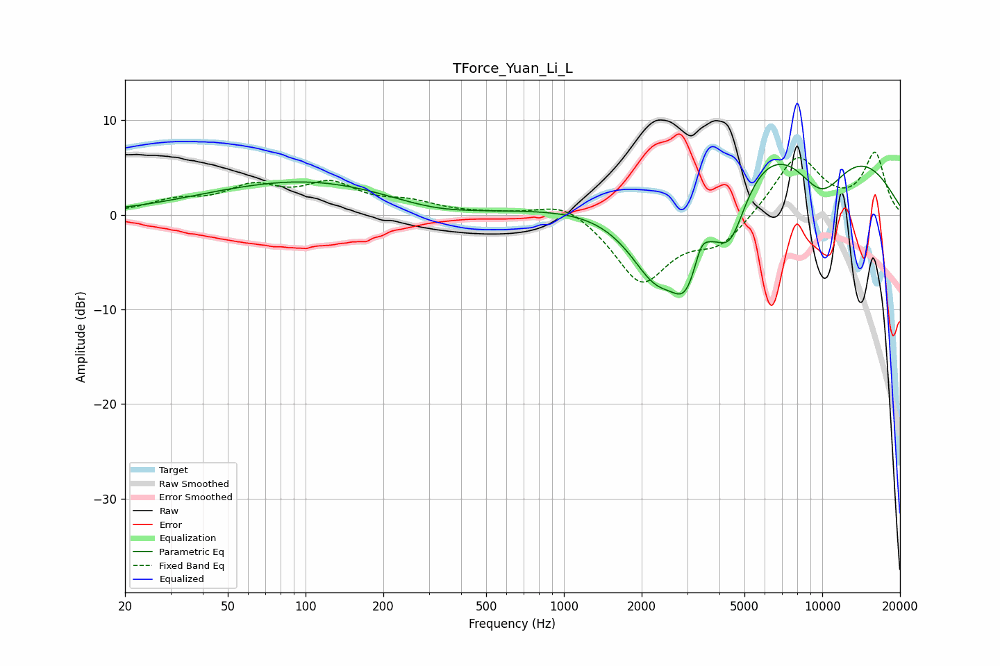

# TForce_Yuan_Li_L
See [usage instructions](https://github.com/jaakkopasanen/AutoEq#usage) for more options and info.

### Parametric EQs
Apply preamp of -5.4 dB when using parametric equalizer.

|   # | Type    |   Fc (Hz) |    Q |   Gain (dB) |
|-----|---------|-----------|------|-------------|
|   1 | Peaking |        40 | 0.81 |         0.2 |
|   2 | Peaking |       102 | 0.4  |         3.5 |
|   3 | Peaking |       312 | 0.84 |        -0.9 |
|   4 | Peaking |      2274 | 1.07 |       -11.2 |
|   5 | Peaking |      2973 | 2.31 |        -6.9 |
|   6 | Peaking |      3400 | 5.68 |         1.7 |
|   7 | Peaking |      4402 | 2.01 |        -7.7 |
|   8 | Peaking |      6534 | 0.2  |         3.3 |
|   9 | Peaking |      6980 | 0.29 |         8.9 |
|  10 | Peaking |      9869 | 1.04 |        -7.6 |

### Fixed Band EQs
When using fixed band (also called graphic) equalizer, apply preamp of **-6.7 dB** (if available) and set gains manually with these parameters.

|   # | Type    |   Fc (Hz) |    Q |   Gain (dB) |
|-----|---------|-----------|------|-------------|
|   1 | Peaking |        31 | 1.41 |         1.3 |
|   2 | Peaking |        62 | 1.41 |         2.6 |
|   3 | Peaking |       125 | 1.41 |         2.9 |
|   4 | Peaking |       250 | 1.41 |         1.1 |
|   5 | Peaking |       500 | 1.41 |         0.1 |
|   6 | Peaking |      1000 | 1.41 |         1.7 |
|   7 | Peaking |      2000 | 1.41 |        -7.1 |
|   8 | Peaking |      4000 | 1.41 |        -3   |
|   9 | Peaking |      8000 | 1.41 |         6.3 |
|  10 | Peaking |     16000 | 1.41 |         6.4 |

### Graphs

