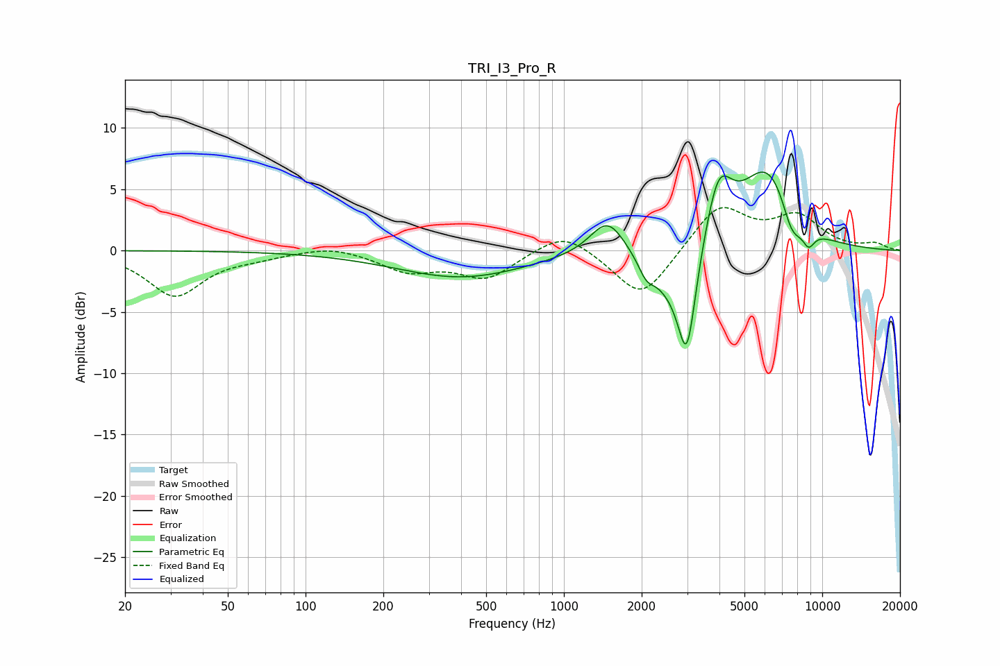

# TRI_I3_Pro_R
See [usage instructions](https://github.com/jaakkopasanen/AutoEq#usage) for more options and info.

### Parametric EQs
Apply preamp of -6.5 dB when using parametric equalizer.

|   # | Type    |   Fc (Hz) |    Q |   Gain (dB) |
|-----|---------|-----------|------|-------------|
|   1 | Peaking |       401 | 0.56 |        -2.2 |
|   2 | Peaking |      1476 | 2.09 |         3   |
|   3 | Peaking |      2081 | 4.56 |        -1.3 |
|   4 | Peaking |      2509 | 1.76 |        -2.4 |
|   5 | Peaking |      2993 | 3.84 |        -8.5 |
|   6 | Peaking |      3965 | 2.65 |         5.4 |
|   7 | Peaking |      6027 | 1.33 |         6   |
|   8 | Peaking |      7028 | 2.21 |         1.2 |
|   9 | Peaking |      7584 | 3.1  |        -3   |
|  10 | Peaking |      8860 | 5.44 |        -1.3 |

### Fixed Band EQs
When using fixed band (also called graphic) equalizer, apply preamp of **-3.6 dB** (if available) and set gains manually with these parameters.

|   # | Type    |   Fc (Hz) |    Q |   Gain (dB) |
|-----|---------|-----------|------|-------------|
|   1 | Peaking |        31 | 1.41 |        -3.7 |
|   2 | Peaking |        62 | 1.41 |        -0.4 |
|   3 | Peaking |       125 | 1.41 |         0.5 |
|   4 | Peaking |       250 | 1.41 |        -1.6 |
|   5 | Peaking |       500 | 1.41 |        -2.2 |
|   6 | Peaking |      1000 | 1.41 |         1.8 |
|   7 | Peaking |      2000 | 1.41 |        -4.1 |
|   8 | Peaking |      4000 | 1.41 |         3.7 |
|   9 | Peaking |      8000 | 1.41 |         2.6 |
|  10 | Peaking |     16000 | 1.41 |         0.5 |

### Graphs

