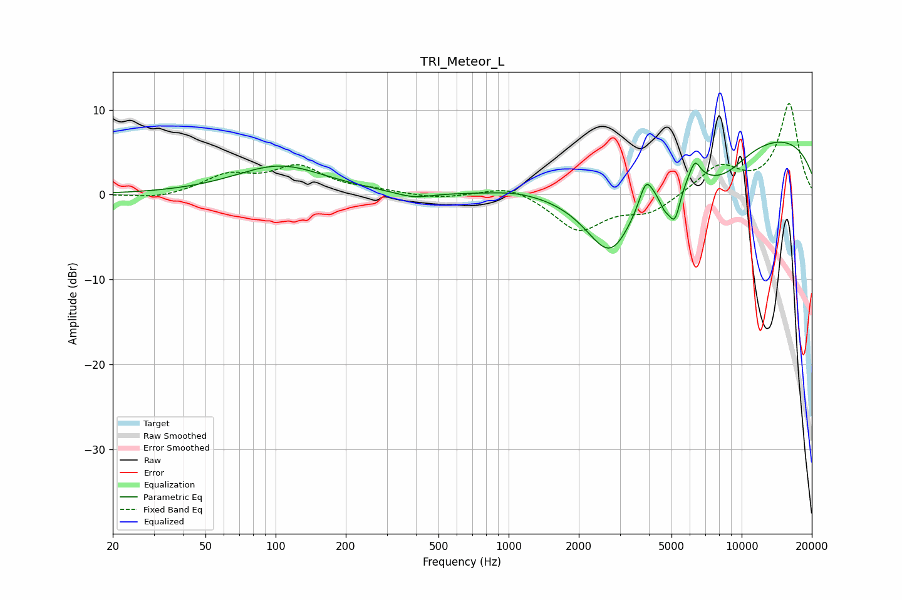

# TRI_Meteor_L
See [usage instructions](https://github.com/jaakkopasanen/AutoEq#usage) for more options and info.

### Parametric EQs
Apply preamp of -6.3 dB when using parametric equalizer.

|   # | Type    |   Fc (Hz) |    Q |   Gain (dB) |
|-----|---------|-----------|------|-------------|
|   1 | Peaking |       105 | 0.73 |         3.4 |
|   2 | Peaking |       390 | 1.8  |        -0.7 |
|   3 | Peaking |      1072 | 1.39 |         0.3 |
|   4 | Peaking |      2748 | 1.13 |       -10.6 |
|   5 | Peaking |      3881 | 5.03 |         2.9 |
|   6 | Peaking |      4673 | 5.88 |        -1.8 |
|   7 | Peaking |      5163 | 5.32 |        -4.4 |
|   8 | Peaking |      6301 | 5.96 |         2.1 |
|   9 | Peaking |      8105 | 1.04 |        -4.1 |
|  10 | Peaking |     10000 | 0.19 |         7.6 |

### Fixed Band EQs
When using fixed band (also called graphic) equalizer, apply preamp of **-10.8 dB** (if available) and set gains manually with these parameters.

|   # | Type    |   Fc (Hz) |    Q |   Gain (dB) |
|-----|---------|-----------|------|-------------|
|   1 | Peaking |        31 | 1.41 |        -0.6 |
|   2 | Peaking |        62 | 1.41 |         2.1 |
|   3 | Peaking |       125 | 1.41 |         3.1 |
|   4 | Peaking |       250 | 1.41 |         0.4 |
|   5 | Peaking |       500 | 1.41 |        -0.5 |
|   6 | Peaking |      1000 | 1.41 |         1.2 |
|   7 | Peaking |      2000 | 1.41 |        -4.2 |
|   8 | Peaking |      4000 | 1.41 |        -2   |
|   9 | Peaking |      8000 | 1.41 |         3.3 |
|  10 | Peaking |     16000 | 1.41 |        10.7 |

### Graphs

