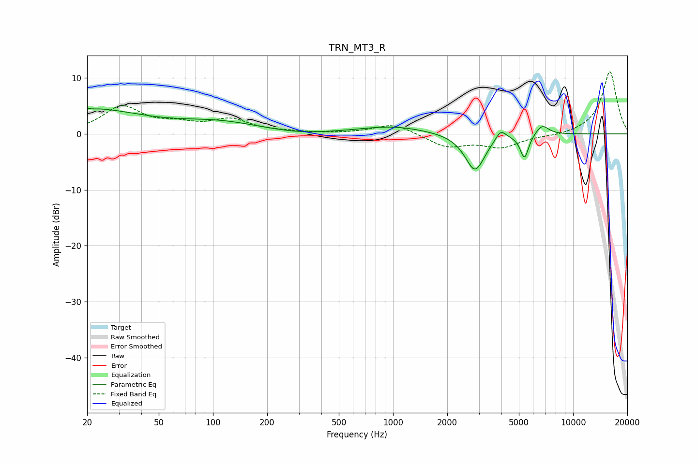

# TRN_MT3_R
See [usage instructions](https://github.com/jaakkopasanen/AutoEq#usage) for more options and info.

### Parametric EQs
Apply preamp of -4.7 dB when using parametric equalizer.

|   # | Type    |   Fc (Hz) |    Q |   Gain (dB) |
|-----|---------|-----------|------|-------------|
|   1 | Peaking |        20 | 0.48 |         4.4 |
|   2 | Peaking |        21 | 5.93 |         3.2 |
|   3 | Peaking |        21 | 6    |        -3.2 |
|   4 | Peaking |       108 | 0.62 |         1.9 |
|   5 | Peaking |       303 | 0.94 |        -0.4 |
|   6 | Peaking |       997 | 0.76 |         1.3 |
|   7 | Peaking |      2852 | 2.55 |        -6.7 |
|   8 | Peaking |      3961 | 4.68 |         1.9 |
|   9 | Peaking |      5369 | 5.94 |        -4.3 |
|  10 | Peaking |      6727 | 3.69 |         1.8 |

### Fixed Band EQs
When using fixed band (also called graphic) equalizer, apply preamp of **-11.2 dB** (if available) and set gains manually with these parameters.

|   # | Type    |   Fc (Hz) |    Q |   Gain (dB) |
|-----|---------|-----------|------|-------------|
|   1 | Peaking |        31 | 1.41 |         4.7 |
|   2 | Peaking |        62 | 1.41 |         1.4 |
|   3 | Peaking |       125 | 1.41 |         2.4 |
|   4 | Peaking |       250 | 1.41 |         0.2 |
|   5 | Peaking |       500 | 1.41 |         0   |
|   6 | Peaking |      1000 | 1.41 |         1.9 |
|   7 | Peaking |      2000 | 1.41 |        -2.3 |
|   8 | Peaking |      4000 | 1.41 |        -2.3 |
|   9 | Peaking |      8000 | 1.41 |        -0.4 |
|  10 | Peaking |     16000 | 1.41 |        11.2 |

### Graphs

