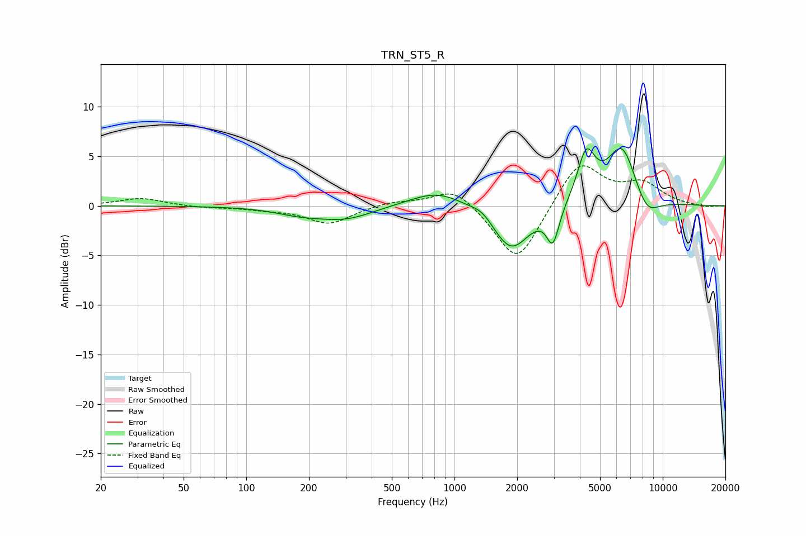

# TRN_ST5_R
See [usage instructions](https://github.com/jaakkopasanen/AutoEq#usage) for more options and info.

### Parametric EQs
Apply preamp of -5.9 dB when using parametric equalizer.

|   # | Type    |   Fc (Hz) |    Q |   Gain (dB) |
|-----|---------|-----------|------|-------------|
|   1 | Peaking |       177 | 1.26 |        -0.5 |
|   2 | Peaking |       304 | 0.94 |        -1.5 |
|   3 | Peaking |       402 | 0.98 |         0.3 |
|   4 | Peaking |       828 | 1.06 |         1.7 |
|   5 | Peaking |      1362 | 2.9  |         0.7 |
|   6 | Peaking |      1870 | 1.58 |        -4.6 |
|   7 | Peaking |      2969 | 4.74 |        -3.6 |
|   8 | Peaking |      4294 | 3.25 |         4.9 |
|   9 | Peaking |      6379 | 1.87 |         6.2 |
|  10 | Peaking |      8335 | 2.15 |        -2.3 |

### Fixed Band EQs
When using fixed band (also called graphic) equalizer, apply preamp of **-4.1 dB** (if available) and set gains manually with these parameters.

|   # | Type    |   Fc (Hz) |    Q |   Gain (dB) |
|-----|---------|-----------|------|-------------|
|   1 | Peaking |        31 | 1.41 |         0.8 |
|   2 | Peaking |        62 | 1.41 |        -0.2 |
|   3 | Peaking |       125 | 1.41 |        -0.3 |
|   4 | Peaking |       250 | 1.41 |        -1.8 |
|   5 | Peaking |       500 | 1.41 |         0.4 |
|   6 | Peaking |      1000 | 1.41 |         2   |
|   7 | Peaking |      2000 | 1.41 |        -6   |
|   8 | Peaking |      4000 | 1.41 |         4.7 |
|   9 | Peaking |      8000 | 1.41 |         2.1 |
|  10 | Peaking |     16000 | 1.41 |        -0.2 |

### Graphs

