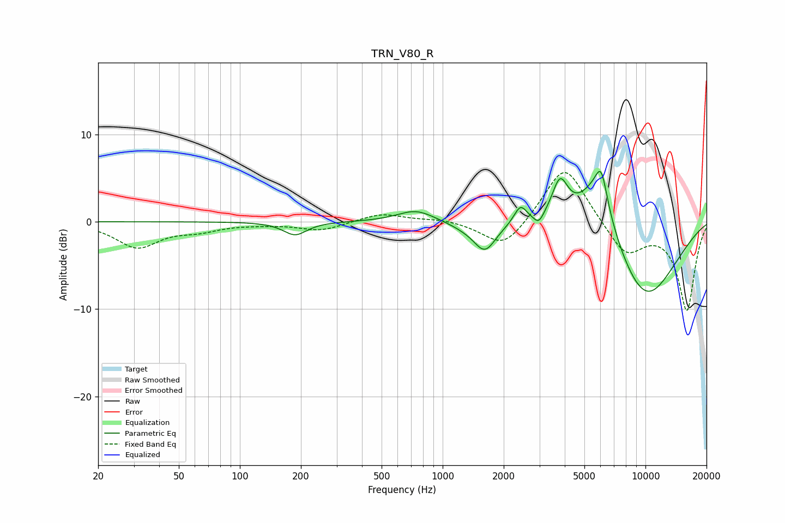

# TRN_V80_R
See [usage instructions](https://github.com/jaakkopasanen/AutoEq#usage) for more options and info.

### Parametric EQs
Apply preamp of -5.8 dB when using parametric equalizer.

|   # | Type    |   Fc (Hz) |    Q |   Gain (dB) |
|-----|---------|-----------|------|-------------|
|   1 | Peaking |       187 | 2.46 |        -1.5 |
|   2 | Peaking |       739 | 1.54 |         1.4 |
|   3 | Peaking |      1317 | 1.65 |        -0.5 |
|   4 | Peaking |      1616 | 2.64 |        -3.1 |
|   5 | Peaking |      2419 | 4.42 |         2.1 |
|   6 | Peaking |      2980 | 6    |        -1.1 |
|   7 | Peaking |      3788 | 3.48 |         4.5 |
|   8 | Peaking |      5762 | 1.43 |         7.2 |
|   9 | Peaking |      6056 | 4.86 |         3.5 |
|  10 | Peaking |      9825 | 0.69 |        -9.4 |

### Fixed Band EQs
When using fixed band (also called graphic) equalizer, apply preamp of **-5.7 dB** (if available) and set gains manually with these parameters.

|   # | Type    |   Fc (Hz) |    Q |   Gain (dB) |
|-----|---------|-----------|------|-------------|
|   1 | Peaking |        31 | 1.41 |        -2.9 |
|   2 | Peaking |        62 | 1.41 |        -0.8 |
|   3 | Peaking |       125 | 1.41 |        -0.2 |
|   4 | Peaking |       250 | 1.41 |        -1   |
|   5 | Peaking |       500 | 1.41 |         1   |
|   6 | Peaking |      1000 | 1.41 |         0.3 |
|   7 | Peaking |      2000 | 1.41 |        -3.3 |
|   8 | Peaking |      4000 | 1.41 |         6.8 |
|   9 | Peaking |      8000 | 1.41 |        -3.8 |
|  10 | Peaking |     16000 | 1.41 |       -10.1 |

### Graphs

