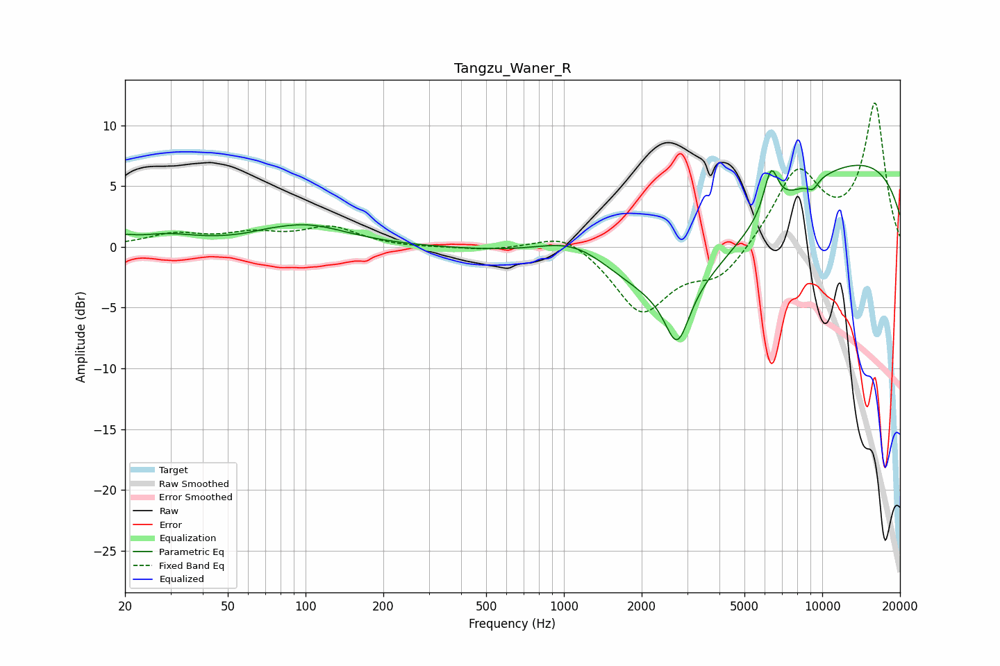

# Tangzu_Waner_R
See [usage instructions](https://github.com/jaakkopasanen/AutoEq#usage) for more options and info.

### Parametric EQs
Apply preamp of -6.8 dB when using parametric equalizer.

|   # | Type    |   Fc (Hz) |    Q |   Gain (dB) |
|-----|---------|-----------|------|-------------|
|   1 | Peaking |        20 | 4.42 |         0.4 |
|   2 | Peaking |        28 | 1.16 |         0.9 |
|   3 | Peaking |        70 | 2.78 |         0.1 |
|   4 | Peaking |       100 | 0.87 |         1.8 |
|   5 | Peaking |      1119 | 0.9  |         2.8 |
|   6 | Peaking |      2745 | 3.02 |        -4.7 |
|   7 | Peaking |      2773 | 0.43 |        -8.9 |
|   8 | Peaking |      6335 | 4.88 |         3.6 |
|   9 | Peaking |      9193 | 5.83 |        -0.8 |
|  10 | Peaking |      9645 | 0.18 |         8.1 |

### Fixed Band EQs
When using fixed band (also called graphic) equalizer, apply preamp of **-11.9 dB** (if available) and set gains manually with these parameters.

|   # | Type    |   Fc (Hz) |    Q |   Gain (dB) |
|-----|---------|-----------|------|-------------|
|   1 | Peaking |        31 | 1.41 |         1   |
|   2 | Peaking |        62 | 1.41 |         0.9 |
|   3 | Peaking |       125 | 1.41 |         1.5 |
|   4 | Peaking |       250 | 1.41 |        -0.1 |
|   5 | Peaking |       500 | 1.41 |        -0.3 |
|   6 | Peaking |      1000 | 1.41 |         1.4 |
|   7 | Peaking |      2000 | 1.41 |        -5.4 |
|   8 | Peaking |      4000 | 1.41 |        -2.5 |
|   9 | Peaking |      8000 | 1.41 |         6.2 |
|  10 | Peaking |     16000 | 1.41 |        11.6 |

### Graphs

