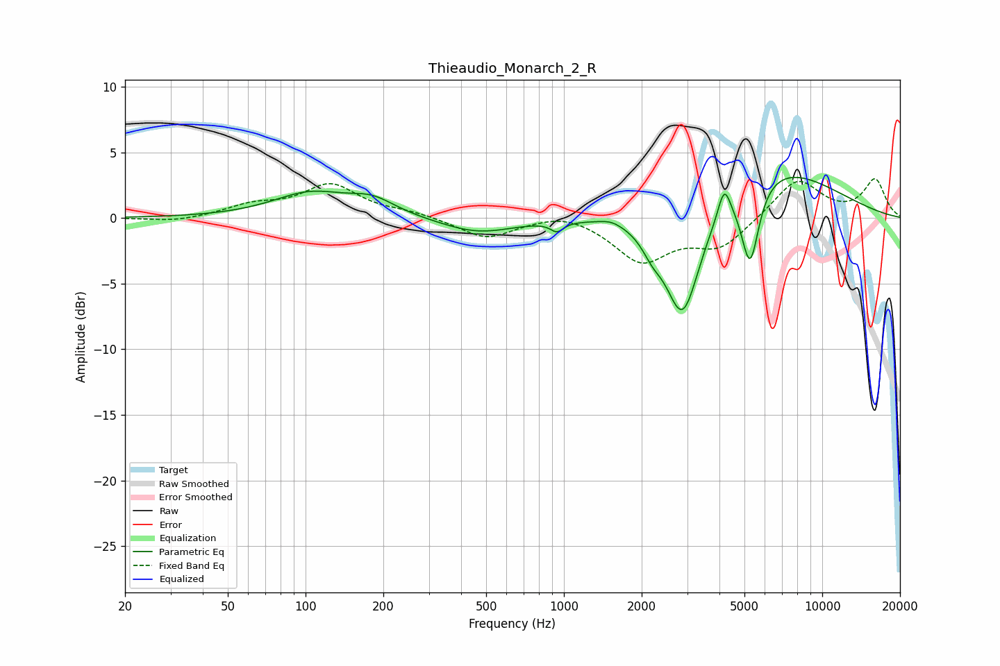

# Thieaudio_Monarch_2_R
See [usage instructions](https://github.com/jaakkopasanen/AutoEq#usage) for more options and info.

### Parametric EQs
Apply preamp of -3.2 dB when using parametric equalizer.

|   # | Type    |   Fc (Hz) |    Q |   Gain (dB) |
|-----|---------|-----------|------|-------------|
|   1 | Peaking |       105 | 0.97 |         1.8 |
|   2 | Peaking |       182 | 1.6  |         1.1 |
|   3 | Peaking |       465 | 0.99 |        -1.2 |
|   4 | Peaking |       940 | 5.7  |        -0.7 |
|   5 | Peaking |      1522 | 3.33 |         0.3 |
|   6 | Peaking |      2194 | 3.6  |        -1.2 |
|   7 | Peaking |      2882 | 2    |        -8.8 |
|   8 | Peaking |      4174 | 5.98 |         2.3 |
|   9 | Peaking |      5257 | 4.07 |        -6.2 |
|  10 | Peaking |      6143 | 0.53 |         4.2 |

### Fixed Band EQs
When using fixed band (also called graphic) equalizer, apply preamp of **-3.1 dB** (if available) and set gains manually with these parameters.

|   # | Type    |   Fc (Hz) |    Q |   Gain (dB) |
|-----|---------|-----------|------|-------------|
|   1 | Peaking |        31 | 1.41 |        -0.3 |
|   2 | Peaking |        62 | 1.41 |         0.9 |
|   3 | Peaking |       125 | 1.41 |         2.5 |
|   4 | Peaking |       250 | 1.41 |         0.4 |
|   5 | Peaking |       500 | 1.41 |        -1.6 |
|   6 | Peaking |      1000 | 1.41 |         0.6 |
|   7 | Peaking |      2000 | 1.41 |        -3.2 |
|   8 | Peaking |      4000 | 1.41 |        -2.2 |
|   9 | Peaking |      8000 | 1.41 |         3   |
|  10 | Peaking |     16000 | 1.41 |         2.9 |

### Graphs

