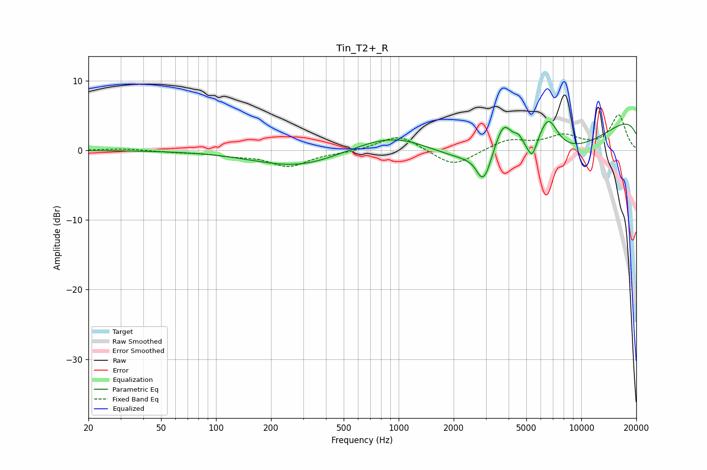

# Tin_T2+_R
See [usage instructions](https://github.com/jaakkopasanen/AutoEq#usage) for more options and info.

### Parametric EQs
Apply preamp of -4.2 dB when using parametric equalizer.

|   # | Type    |   Fc (Hz) |    Q |   Gain (dB) |
|-----|---------|-----------|------|-------------|
|   1 | Peaking |       283 | 0.59 |        -2.5 |
|   2 | Peaking |       964 | 0.63 |         3.5 |
|   3 | Peaking |      2795 | 5.63 |        -0.9 |
|   4 | Peaking |      2967 | 3.91 |        -3.2 |
|   5 | Peaking |      3757 | 2.78 |         5.3 |
|   6 | Peaking |      4541 | 5.36 |         1.5 |
|   7 | Peaking |      5385 | 5.99 |        -2.2 |
|   8 | Peaking |      5649 | 0.26 |        -9.6 |
|   9 | Peaking |      6577 | 2.44 |         5.4 |
|  10 | Peaking |     10000 | 0.18 |         8.4 |

### Fixed Band EQs
When using fixed band (also called graphic) equalizer, apply preamp of **-5.2 dB** (if available) and set gains manually with these parameters.

|   # | Type    |   Fc (Hz) |    Q |   Gain (dB) |
|-----|---------|-----------|------|-------------|
|   1 | Peaking |        31 | 1.41 |         0.3 |
|   2 | Peaking |        62 | 1.41 |        -0.2 |
|   3 | Peaking |       125 | 1.41 |        -0.6 |
|   4 | Peaking |       250 | 1.41 |        -2.2 |
|   5 | Peaking |       500 | 1.41 |        -0.2 |
|   6 | Peaking |      1000 | 1.41 |         2.3 |
|   7 | Peaking |      2000 | 1.41 |        -2.4 |
|   8 | Peaking |      4000 | 1.41 |         1.5 |
|   9 | Peaking |      8000 | 1.41 |         1.9 |
|  10 | Peaking |     16000 | 1.41 |         5   |

### Graphs

