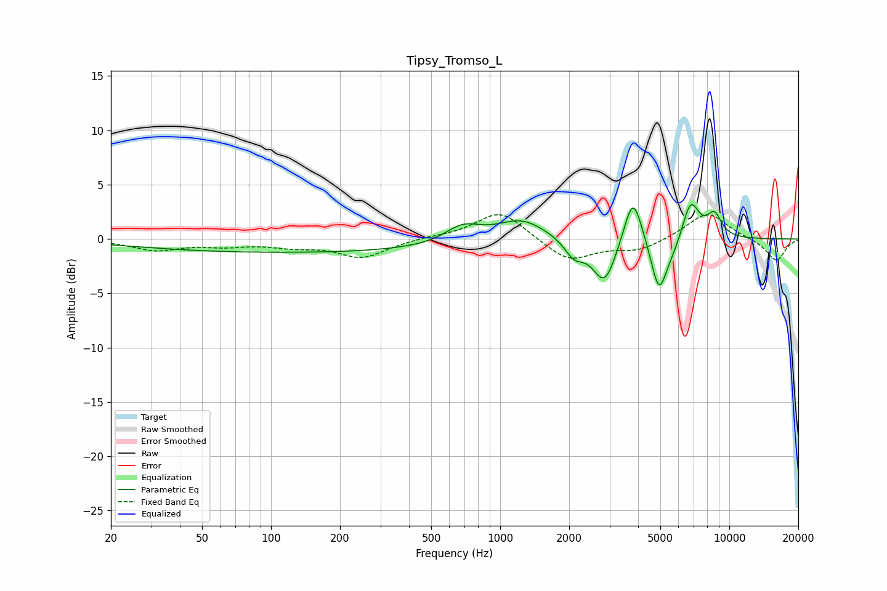

# Tipsy_Tromso_L
See [usage instructions](https://github.com/jaakkopasanen/AutoEq#usage) for more options and info.

### Parametric EQs
Apply preamp of -3.3 dB when using parametric equalizer.

|   # | Type    |   Fc (Hz) |    Q |   Gain (dB) |
|-----|---------|-----------|------|-------------|
|   1 | Peaking |       128 | 0.18 |        -1.2 |
|   2 | Peaking |       687 | 1.85 |         1.5 |
|   3 | Peaking |      1235 | 1.28 |         1.9 |
|   4 | Peaking |      2104 | 3.34 |        -1.6 |
|   5 | Peaking |      2854 | 2.73 |        -4.2 |
|   6 | Peaking |      3798 | 3.58 |         4.7 |
|   7 | Peaking |      4927 | 4.09 |        -4.6 |
|   8 | Peaking |      5666 | 2.6  |        -1.2 |
|   9 | Peaking |      6771 | 3.55 |         3.8 |
|  10 | Peaking |      8599 | 4    |         2.1 |

### Fixed Band EQs
When using fixed band (also called graphic) equalizer, apply preamp of **-2.3 dB** (if available) and set gains manually with these parameters.

|   # | Type    |   Fc (Hz) |    Q |   Gain (dB) |
|-----|---------|-----------|------|-------------|
|   1 | Peaking |        31 | 1.41 |        -1   |
|   2 | Peaking |        62 | 1.41 |        -0.5 |
|   3 | Peaking |       125 | 1.41 |        -0.6 |
|   4 | Peaking |       250 | 1.41 |        -1.7 |
|   5 | Peaking |       500 | 1.41 |         0.1 |
|   6 | Peaking |      1000 | 1.41 |         2.6 |
|   7 | Peaking |      2000 | 1.41 |        -2.1 |
|   8 | Peaking |      4000 | 1.41 |        -1   |
|   9 | Peaking |      8000 | 1.41 |         2.5 |
|  10 | Peaking |     16000 | 1.41 |        -2.1 |

### Graphs

