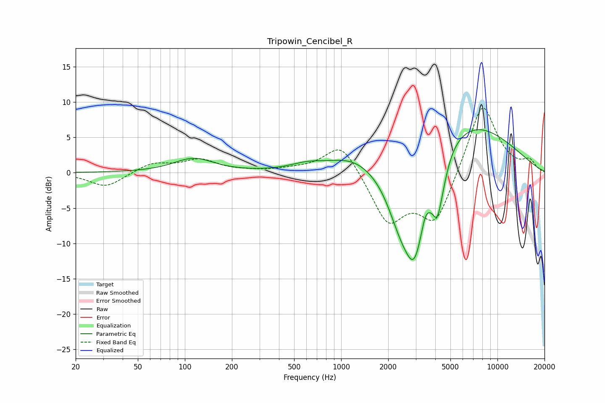

# Tripowin_Cencibel_R
See [usage instructions](https://github.com/jaakkopasanen/AutoEq#usage) for more options and info.

### Parametric EQs
Apply preamp of -6.2 dB when using parametric equalizer.

|   # | Type    |   Fc (Hz) |    Q |   Gain (dB) |
|-----|---------|-----------|------|-------------|
|   1 | Peaking |       114 | 1.11 |         2   |
|   2 | Peaking |       603 | 1.29 |         0.9 |
|   3 | Peaking |      1171 | 0.92 |         1.9 |
|   4 | Peaking |      2369 | 1.58 |        -4.4 |
|   5 | Peaking |      2467 | 1.91 |        -1.3 |
|   6 | Peaking |      2949 | 1.75 |       -13.1 |
|   7 | Peaking |      3452 | 6    |         1.3 |
|   8 | Peaking |      4135 | 4.02 |        -6.3 |
|   9 | Peaking |      4591 | 4.07 |        -0.9 |
|  10 | Peaking |      6097 | 0.43 |         7.8 |

### Fixed Band EQs
When using fixed band (also called graphic) equalizer, apply preamp of **-9.2 dB** (if available) and set gains manually with these parameters.

|   # | Type    |   Fc (Hz) |    Q |   Gain (dB) |
|-----|---------|-----------|------|-------------|
|   1 | Peaking |        31 | 1.41 |        -2.1 |
|   2 | Peaking |        62 | 1.41 |         1.3 |
|   3 | Peaking |       125 | 1.41 |         1.7 |
|   4 | Peaking |       250 | 1.41 |         0.1 |
|   5 | Peaking |       500 | 1.41 |         0.4 |
|   6 | Peaking |      1000 | 1.41 |         4.5 |
|   7 | Peaking |      2000 | 1.41 |        -7   |
|   8 | Peaking |      4000 | 1.41 |        -7.1 |
|   9 | Peaking |      8000 | 1.41 |        10.3 |
|  10 | Peaking |     16000 | 1.41 |         1.5 |

### Graphs

