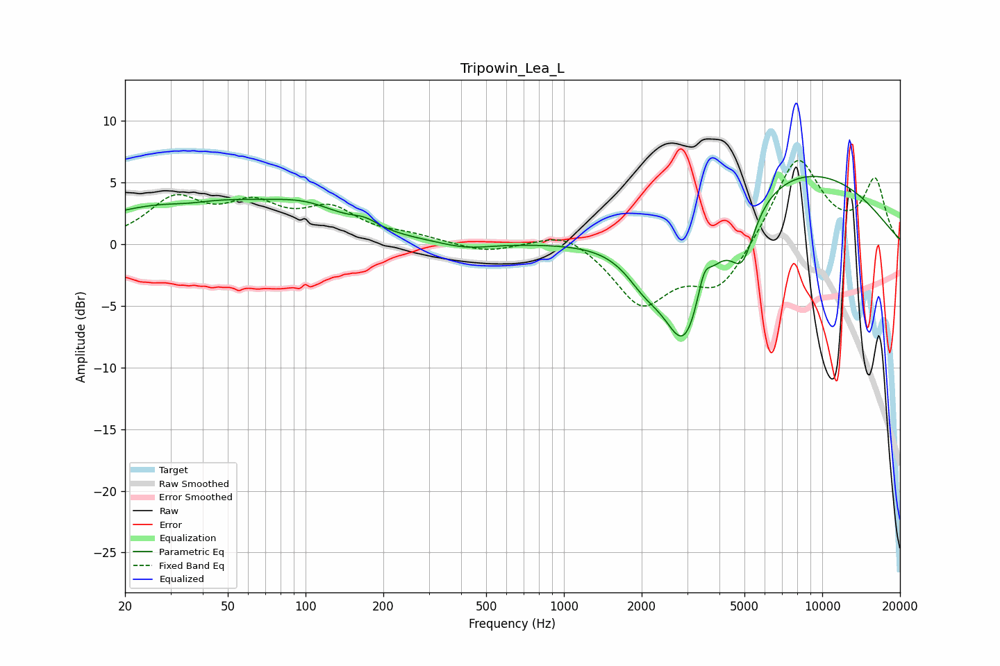

# Tripowin_Lea_L
See [usage instructions](https://github.com/jaakkopasanen/AutoEq#usage) for more options and info.

### Parametric EQs
Apply preamp of -5.6 dB when using parametric equalizer.

|   # | Type    |   Fc (Hz) |    Q |   Gain (dB) |
|-----|---------|-----------|------|-------------|
|   1 | Peaking |        35 | 1.5  |        -0.4 |
|   2 | Peaking |        37 | 0.4  |         3.5 |
|   3 | Peaking |       102 | 0.99 |         1.6 |
|   4 | Peaking |       170 | 2.76 |         0.6 |
|   5 | Peaking |       417 | 1.44 |        -0.5 |
|   6 | Peaking |      2052 | 1.87 |        -2.1 |
|   7 | Peaking |      2932 | 1.56 |       -10.1 |
|   8 | Peaking |      3487 | 5.81 |         2   |
|   9 | Peaking |      4910 | 2.92 |        -4.2 |
|  10 | Peaking |      7710 | 0.35 |         6.3 |

### Fixed Band EQs
When using fixed band (also called graphic) equalizer, apply preamp of **-6.9 dB** (if available) and set gains manually with these parameters.

|   # | Type    |   Fc (Hz) |    Q |   Gain (dB) |
|-----|---------|-----------|------|-------------|
|   1 | Peaking |        31 | 1.41 |         3.4 |
|   2 | Peaking |        62 | 1.41 |         2.7 |
|   3 | Peaking |       125 | 1.41 |         2.5 |
|   4 | Peaking |       250 | 1.41 |         0.5 |
|   5 | Peaking |       500 | 1.41 |        -0.7 |
|   6 | Peaking |      1000 | 1.41 |         1.3 |
|   7 | Peaking |      2000 | 1.41 |        -4.8 |
|   8 | Peaking |      4000 | 1.41 |        -3.6 |
|   9 | Peaking |      8000 | 1.41 |         7.2 |
|  10 | Peaking |     16000 | 1.41 |         5.1 |

### Graphs

