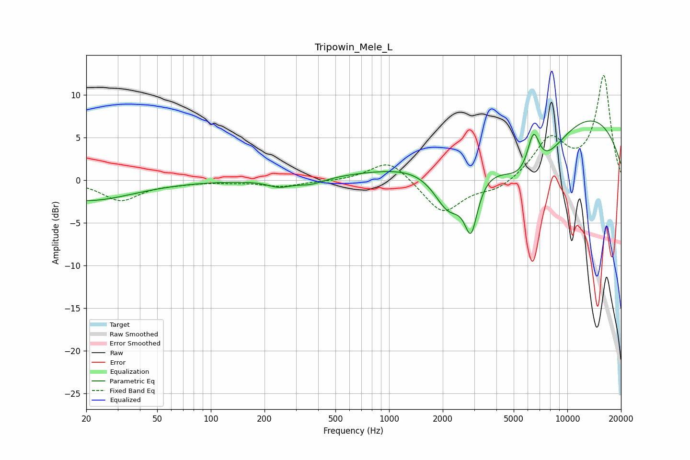

# Tripowin_Mele_L
See [usage instructions](https://github.com/jaakkopasanen/AutoEq#usage) for more options and info.

### Parametric EQs
Apply preamp of -7.0 dB when using parametric equalizer.

|   # | Type    |   Fc (Hz) |    Q |   Gain (dB) |
|-----|---------|-----------|------|-------------|
|   1 | Peaking |        20 | 0.54 |        -2.4 |
|   2 | Peaking |       242 | 2.17 |        -0.8 |
|   3 | Peaking |       363 | 1.79 |        -0.7 |
|   4 | Peaking |       630 | 0.59 |         0.3 |
|   5 | Peaking |      2163 | 1.57 |        -5.7 |
|   6 | Peaking |      2858 | 4.35 |         0.8 |
|   7 | Peaking |      2880 | 3.75 |        -7.2 |
|   8 | Peaking |      6248 | 0.61 |       -12.2 |
|   9 | Peaking |      6455 | 3.71 |         5.2 |
|  10 | Peaking |      8104 | 0.25 |        13.1 |

### Fixed Band EQs
When using fixed band (also called graphic) equalizer, apply preamp of **-12.4 dB** (if available) and set gains manually with these parameters.

|   # | Type    |   Fc (Hz) |    Q |   Gain (dB) |
|-----|---------|-----------|------|-------------|
|   1 | Peaking |        31 | 1.41 |        -2.3 |
|   2 | Peaking |        62 | 1.41 |        -0.3 |
|   3 | Peaking |       125 | 1.41 |        -0.2 |
|   4 | Peaking |       250 | 1.41 |        -0.7 |
|   5 | Peaking |       500 | 1.41 |        -0.1 |
|   6 | Peaking |      1000 | 1.41 |         2.5 |
|   7 | Peaking |      2000 | 1.41 |        -4   |
|   8 | Peaking |      4000 | 1.41 |        -1.2 |
|   9 | Peaking |      8000 | 1.41 |         4.7 |
|  10 | Peaking |     16000 | 1.41 |        12.2 |

### Graphs

