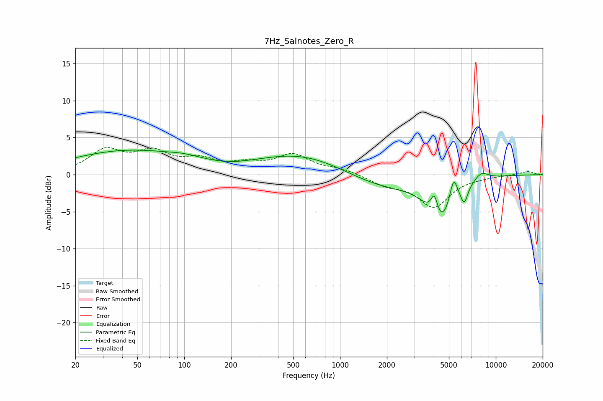

# 7Hz_Salnotes_Zero_R
See [usage instructions](https://github.com/jaakkopasanen/AutoEq#usage) for more options and info.

### Parametric EQs
Apply preamp of -3.4 dB when using parametric equalizer.

|   # | Type    |   Fc (Hz) |    Q |   Gain (dB) |
|-----|---------|-----------|------|-------------|
|   1 | Peaking |        44 | 0.37 |         3.2 |
|   2 | Peaking |       100 | 1.45 |         0.4 |
|   3 | Peaking |       197 | 1.36 |        -0.3 |
|   4 | Peaking |       571 | 0.49 |         2.8 |
|   5 | Peaking |      1835 | 0.58 |        -1.9 |
|   6 | Peaking |      4036 | 6    |         3.2 |
|   7 | Peaking |      4361 | 1.75 |        -6.2 |
|   8 | Peaking |      5355 | 5.69 |         3.2 |
|   9 | Peaking |      6269 | 5.99 |        -2.3 |
|  10 | Peaking |      8066 | 2.91 |         1.1 |

### Fixed Band EQs
When using fixed band (also called graphic) equalizer, apply preamp of **-3.8 dB** (if available) and set gains manually with these parameters.

|   # | Type    |   Fc (Hz) |    Q |   Gain (dB) |
|-----|---------|-----------|------|-------------|
|   1 | Peaking |        31 | 1.41 |         3.1 |
|   2 | Peaking |        62 | 1.41 |         2.7 |
|   3 | Peaking |       125 | 1.41 |         1.7 |
|   4 | Peaking |       250 | 1.41 |         1.1 |
|   5 | Peaking |       500 | 1.41 |         2.5 |
|   6 | Peaking |      1000 | 1.41 |         0.7 |
|   7 | Peaking |      2000 | 1.41 |        -1.2 |
|   8 | Peaking |      4000 | 1.41 |        -4.2 |
|   9 | Peaking |      8000 | 1.41 |        -0.2 |
|  10 | Peaking |     16000 | 1.41 |         0.5 |

### Graphs

