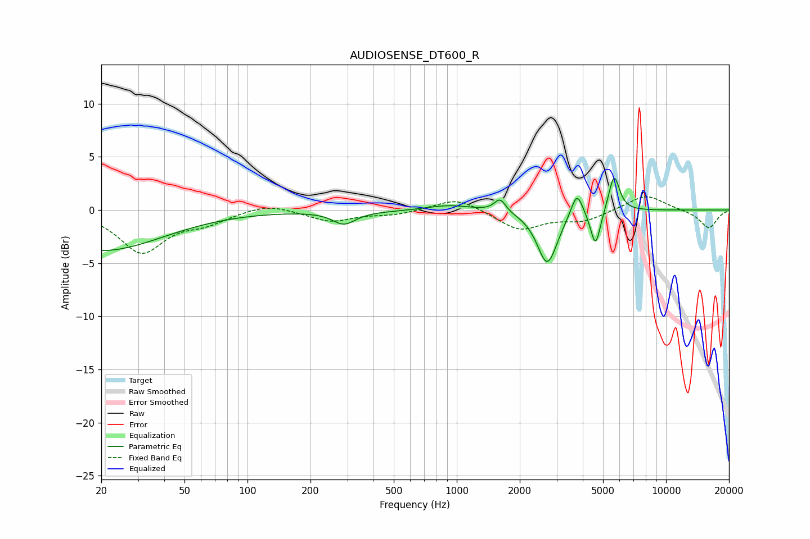

# AUDIOSENSE_DT600_R
See [usage instructions](https://github.com/jaakkopasanen/AutoEq#usage) for more options and info.

### Parametric EQs
Apply preamp of -3.1 dB when using parametric equalizer.

|   # | Type    |   Fc (Hz) |    Q |   Gain (dB) |
|-----|---------|-----------|------|-------------|
|   1 | Peaking |        20 | 0.48 |        -3.8 |
|   2 | Peaking |       289 | 2.61 |        -1.2 |
|   3 | Peaking |       521 | 0.59 |        -0.1 |
|   4 | Peaking |       914 | 1.24 |         0.6 |
|   5 | Peaking |      1610 | 5.24 |         1.2 |
|   6 | Peaking |      2709 | 2.94 |        -5.1 |
|   7 | Peaking |      3666 | 6    |        -0.5 |
|   8 | Peaking |      3735 | 5.05 |         2.8 |
|   9 | Peaking |      4606 | 5.91 |        -3.5 |
|  10 | Peaking |      5646 | 5.47 |         3.5 |

### Fixed Band EQs
When using fixed band (also called graphic) equalizer, apply preamp of **-1.3 dB** (if available) and set gains manually with these parameters.

|   # | Type    |   Fc (Hz) |    Q |   Gain (dB) |
|-----|---------|-----------|------|-------------|
|   1 | Peaking |        31 | 1.41 |        -3.9 |
|   2 | Peaking |        62 | 1.41 |        -1   |
|   3 | Peaking |       125 | 1.41 |         0.7 |
|   4 | Peaking |       250 | 1.41 |        -1.1 |
|   5 | Peaking |       500 | 1.41 |        -0.4 |
|   6 | Peaking |      1000 | 1.41 |         1.2 |
|   7 | Peaking |      2000 | 1.41 |        -1.9 |
|   8 | Peaking |      4000 | 1.41 |        -1   |
|   9 | Peaking |      8000 | 1.41 |         1.5 |
|  10 | Peaking |     16000 | 1.41 |        -1.7 |

### Graphs

