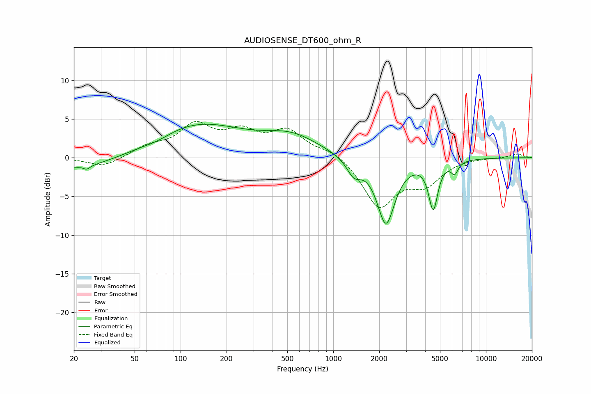

# AUDIOSENSE_DT600_ohm_R
See [usage instructions](https://github.com/jaakkopasanen/AutoEq#usage) for more options and info.

### Parametric EQs
Apply preamp of -4.4 dB when using parametric equalizer.

|   # | Type    |   Fc (Hz) |    Q |   Gain (dB) |
|-----|---------|-----------|------|-------------|
|   1 | Peaking |        22 | 0.37 |        -1.8 |
|   2 | Peaking |        24 | 5.98 |         1.8 |
|   3 | Peaking |        24 | 5.88 |        -2.2 |
|   4 | Peaking |        70 | 1.45 |        -0.6 |
|   5 | Peaking |       122 | 0.43 |         4.5 |
|   6 | Peaking |       539 | 0.79 |         2.4 |
|   7 | Peaking |      1366 | 3.01 |        -2.1 |
|   8 | Peaking |      2213 | 2.39 |        -8.5 |
|   9 | Peaking |      4517 | 4.68 |        -6.1 |
|  10 | Peaking |      6241 | 6    |        -1.5 |

### Fixed Band EQs
When using fixed band (also called graphic) equalizer, apply preamp of **-4.8 dB** (if available) and set gains manually with these parameters.

|   # | Type    |   Fc (Hz) |    Q |   Gain (dB) |
|-----|---------|-----------|------|-------------|
|   1 | Peaking |        31 | 1.41 |        -1.2 |
|   2 | Peaking |        62 | 1.41 |         1.2 |
|   3 | Peaking |       125 | 1.41 |         3.9 |
|   4 | Peaking |       250 | 1.41 |         2.8 |
|   5 | Peaking |       500 | 1.41 |         3.2 |
|   6 | Peaking |      1000 | 1.41 |         1   |
|   7 | Peaking |      2000 | 1.41 |        -6.2 |
|   8 | Peaking |      4000 | 1.41 |        -3   |
|   9 | Peaking |      8000 | 1.41 |         0.1 |
|  10 | Peaking |     16000 | 1.41 |         0.5 |

### Graphs

