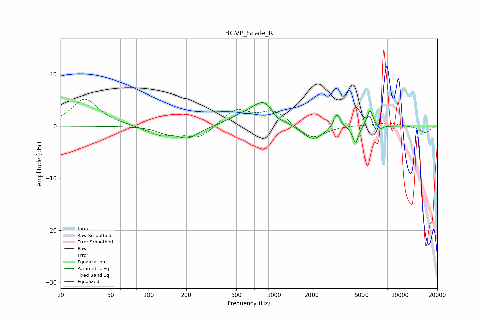

# BGVP_Scale_R
See [usage instructions](https://github.com/jaakkopasanen/AutoEq#usage) for more options and info.

### Parametric EQs
Apply preamp of -4.6 dB when using parametric equalizer.

|   # | Type    |   Fc (Hz) |    Q |   Gain (dB) |
|-----|---------|-----------|------|-------------|
|   1 | Peaking |       136 | 1.94 |        -0.9 |
|   2 | Peaking |       206 | 1.58 |        -2.3 |
|   3 | Peaking |       546 | 1.3  |         1.2 |
|   4 | Peaking |       829 | 1.57 |         4.4 |
|   5 | Peaking |      1054 | 3.33 |        -0.9 |
|   6 | Peaking |      2036 | 1.71 |        -2.9 |
|   7 | Peaking |      3170 | 5.62 |         2.8 |
|   8 | Peaking |      4470 | 6    |        -3.4 |
|   9 | Peaking |      5795 | 5.87 |         3.3 |
|  10 | Peaking |      7039 | 6    |        -0.7 |

### Fixed Band EQs
When using fixed band (also called graphic) equalizer, apply preamp of **-5.3 dB** (if available) and set gains manually with these parameters.

|   # | Type    |   Fc (Hz) |    Q |   Gain (dB) |
|-----|---------|-----------|------|-------------|
|   1 | Peaking |        31 | 1.41 |         5.2 |
|   2 | Peaking |        62 | 1.41 |         0.1 |
|   3 | Peaking |       125 | 1.41 |        -1.8 |
|   4 | Peaking |       250 | 1.41 |        -2.4 |
|   5 | Peaking |       500 | 1.41 |         3.2 |
|   6 | Peaking |      1000 | 1.41 |         2.8 |
|   7 | Peaking |      2000 | 1.41 |        -2.7 |
|   8 | Peaking |      4000 | 1.41 |         0.2 |
|   9 | Peaking |      8000 | 1.41 |         0.7 |
|  10 | Peaking |     16000 | 1.41 |        -1.3 |

### Graphs

