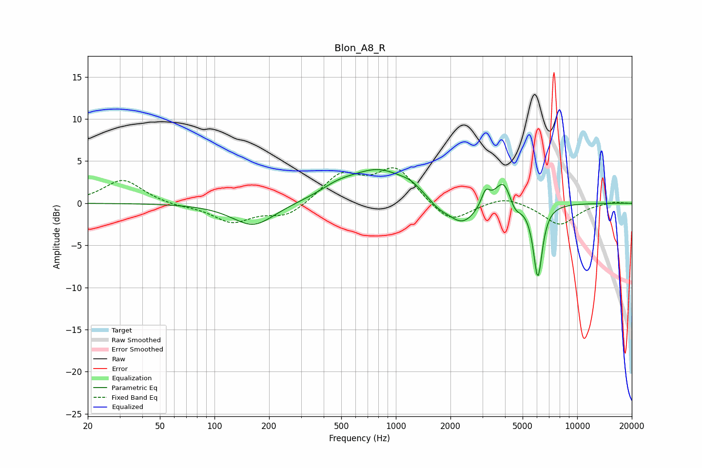

# Blon_A8_R
See [usage instructions](https://github.com/jaakkopasanen/AutoEq#usage) for more options and info.

### Parametric EQs
Apply preamp of -4.1 dB when using parametric equalizer.

|   # | Type    |   Fc (Hz) |    Q |   Gain (dB) |
|-----|---------|-----------|------|-------------|
|   1 | Peaking |       164 | 1.21 |        -2.8 |
|   2 | Peaking |       478 | 1.43 |         1   |
|   3 | Peaking |       812 | 0.84 |         3.9 |
|   4 | Peaking |      1209 | 2.61 |         0.6 |
|   5 | Peaking |      1706 | 2.7  |        -0.8 |
|   6 | Peaking |      2320 | 1.71 |        -2.9 |
|   7 | Peaking |      3125 | 6    |         1.8 |
|   8 | Peaking |      3946 | 2.92 |         3.5 |
|   9 | Peaking |      4510 | 3.96 |        -1.7 |
|  10 | Peaking |      6065 | 5.48 |        -8.8 |

### Fixed Band EQs
When using fixed band (also called graphic) equalizer, apply preamp of **-4.3 dB** (if available) and set gains manually with these parameters.

|   # | Type    |   Fc (Hz) |    Q |   Gain (dB) |
|-----|---------|-----------|------|-------------|
|   1 | Peaking |        31 | 1.41 |         2.8 |
|   2 | Peaking |        62 | 1.41 |        -0.3 |
|   3 | Peaking |       125 | 1.41 |        -2.2 |
|   4 | Peaking |       250 | 1.41 |        -1.6 |
|   5 | Peaking |       500 | 1.41 |         3.3 |
|   6 | Peaking |      1000 | 1.41 |         4.1 |
|   7 | Peaking |      2000 | 1.41 |        -2.5 |
|   8 | Peaking |      4000 | 1.41 |         0.9 |
|   9 | Peaking |      8000 | 1.41 |        -2.6 |
|  10 | Peaking |     16000 | 1.41 |         0.2 |

### Graphs

