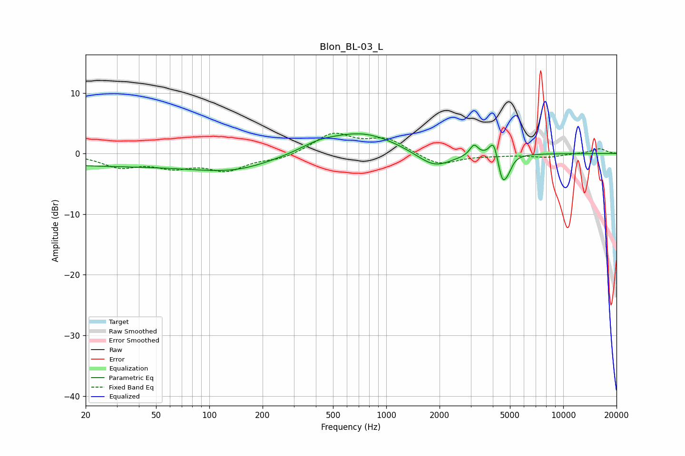

# Blon_BL-03_L
See [usage instructions](https://github.com/jaakkopasanen/AutoEq#usage) for more options and info.

### Parametric EQs
Apply preamp of -3.3 dB when using parametric equalizer.

|   # | Type    |   Fc (Hz) |    Q |   Gain (dB) |
|-----|---------|-----------|------|-------------|
|   1 | Peaking |        32 | 0.18 |        -2   |
|   2 | Peaking |       143 | 0.66 |        -1.7 |
|   3 | Peaking |       414 | 1.32 |         1.1 |
|   4 | Peaking |       735 | 0.72 |         3.4 |
|   5 | Peaking |      1871 | 1.4  |        -2.7 |
|   6 | Peaking |      3054 | 5.94 |        -0.7 |
|   7 | Peaking |      3112 | 5.83 |         2.4 |
|   8 | Peaking |      4042 | 5.98 |         3   |
|   9 | Peaking |      4535 | 5.52 |        -4.3 |
|  10 | Peaking |      4903 | 5.94 |        -1.5 |

### Fixed Band EQs
When using fixed band (also called graphic) equalizer, apply preamp of **-3.5 dB** (if available) and set gains manually with these parameters.

|   # | Type    |   Fc (Hz) |    Q |   Gain (dB) |
|-----|---------|-----------|------|-------------|
|   1 | Peaking |        31 | 1.41 |        -2   |
|   2 | Peaking |        62 | 1.41 |        -1.9 |
|   3 | Peaking |       125 | 1.41 |        -2.5 |
|   4 | Peaking |       250 | 1.41 |        -0.9 |
|   5 | Peaking |       500 | 1.41 |         3.2 |
|   6 | Peaking |      1000 | 1.41 |         2.3 |
|   7 | Peaking |      2000 | 1.41 |        -2   |
|   8 | Peaking |      4000 | 1.41 |        -0.2 |
|   9 | Peaking |      8000 | 1.41 |        -0.6 |
|  10 | Peaking |     16000 | 1.41 |         0.8 |

### Graphs

