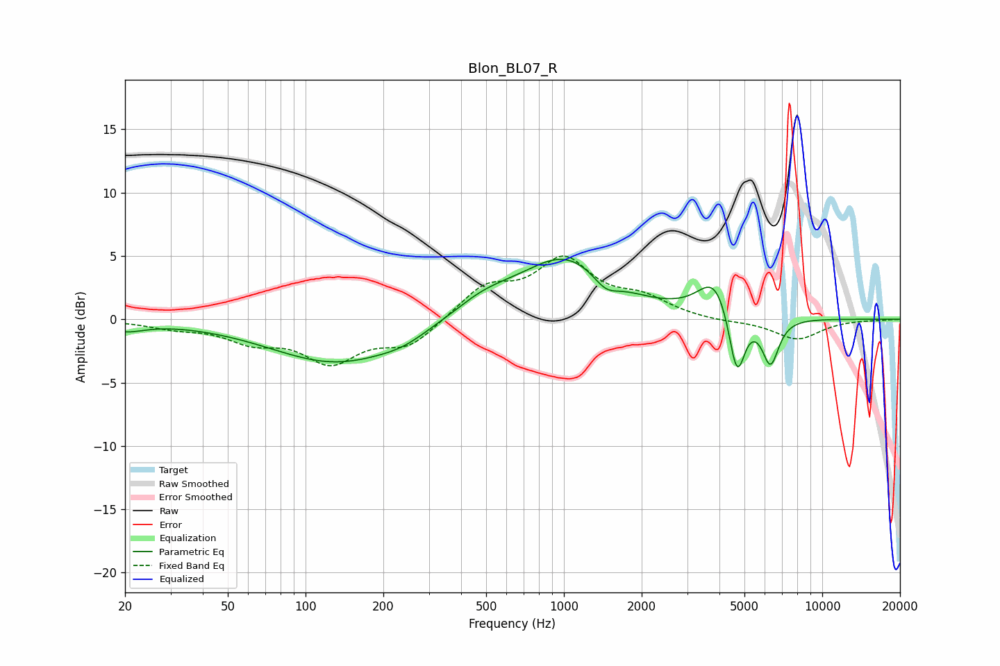

# Blon_BL07_R
See [usage instructions](https://github.com/jaakkopasanen/AutoEq#usage) for more options and info.

### Parametric EQs
Apply preamp of -4.8 dB when using parametric equalizer.

|   # | Type    |   Fc (Hz) |    Q |   Gain (dB) |
|-----|---------|-----------|------|-------------|
|   1 | Peaking |        20 | 1.88 |        -0.7 |
|   2 | Peaking |       133 | 0.55 |        -3.5 |
|   3 | Peaking |       239 | 1.57 |        -0.5 |
|   4 | Peaking |       489 | 1.13 |         1.3 |
|   5 | Peaking |      1014 | 0.8  |         4.8 |
|   6 | Peaking |      1452 | 2.84 |        -1.2 |
|   7 | Peaking |      3836 | 2.17 |         3   |
|   8 | Peaking |      4576 | 4.77 |        -1.5 |
|   9 | Peaking |      4710 | 4.68 |        -3.9 |
|  10 | Peaking |      6304 | 4.24 |        -3.7 |

### Fixed Band EQs
When using fixed band (also called graphic) equalizer, apply preamp of **-5.1 dB** (if available) and set gains manually with these parameters.

|   # | Type    |   Fc (Hz) |    Q |   Gain (dB) |
|-----|---------|-----------|------|-------------|
|   1 | Peaking |        31 | 1.41 |        -0.5 |
|   2 | Peaking |        62 | 1.41 |        -1.5 |
|   3 | Peaking |       125 | 1.41 |        -3.1 |
|   4 | Peaking |       250 | 1.41 |        -2   |
|   5 | Peaking |       500 | 1.41 |         2.4 |
|   6 | Peaking |      1000 | 1.41 |         4.4 |
|   7 | Peaking |      2000 | 1.41 |         1.4 |
|   8 | Peaking |      4000 | 1.41 |        -0.2 |
|   9 | Peaking |      8000 | 1.41 |        -1.6 |
|  10 | Peaking |     16000 | 1.41 |        -0   |

### Graphs

